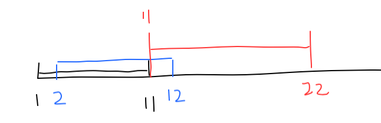

## 贪心算法

> 从局部最优解（只考虑当前情况的最优解） -> 全局最优解
>
> 典型例子：背包问题

#### 1. 分配饼干

[LeetCode 455. Assign Cookies (Easy)](https://leetcode.com/problems/assign-cookies/description/)

分析：由于需要尽量分配更多的孩子，意味着每次分配完成，尽量保证剩下的饼干尽量多，那么分配策略如下

- 挑要求最小的孩子先分配
- 每次分配时，尽量用最小的饼干来满足该孩子

实现：对**孩子**和**饼干**排序，生序序列。i，j分别从序列开始处往后遍历。如果当前饼干可以满足孩子的要求，i，j同时后移一位并让res值+1。如果不能满足，那就只让饼干j后移一位。当i，j任何一个移动到数组末尾时，循环结束，返回统计值即可。

```python
class Solution:
    def findContentChildren(self, g: List[int], s: List[int]) -> int:
        childs = sorted(g)
        cookies = sorted(s)
        
        i, j, res = 0, 0, 0
        
        while j < len(cookies) and i < len(childs):
            if cookies[j] >= childs[i]:
                res += 1
                i += 1
                j += 1
            else:
                j += 1
        return res
```

#### 2. 重叠区间统计

[LeetCode 435. Non-overlapping Intervals (Medium)](https://leetcode.com/problems/non-overlapping-intervals/)

题意：给定一个列表，列表中包含多个闭区间。闭区间有重叠部分（不包括相接但不重合区间）。问需要删除多少个区间才能使所有的区间都不重叠。

思路：由于给定区间是一维的，可以想象，如果只知道左端点是无法判断区间的整体位置情况的。如果给出右区间，那么整个区间的位置便可以大致确定。

- 按照每个区间的右端点进行排序，得到一个右端点的升序区间列表
- 从第2个区间开始判断其余前一个区间是否重合（重合有两个条件：①当前区间的右端点与前一个区间的右端点相同，②当前区间的左端值小于前一个区间的右端点）
- 如果当前区间与前一个区间不重合，对比区间prev，就设置为当前区间（**这里主要思想是：我们尽量让右边的区间靠左，那么后面可以分配更多的不重叠区间，参考下面图解**）

`[1, 11]`和`[2, 12]`是重叠区间，一定要删除一个，然后后面的区间`[11, 22]`与前一个进行重叠判断。这时候，需要删除的一定是蓝色的`[2, 12]`，因为，删除此区间会流出更多的区间范围给后面的区间。



```python
# Python
class Solution:
    def eraseOverlapIntervals(self, intervals: List[List[int]]) -> int:
        if len(intervals) <= 1: return 0
        intervals = sorted(intervals, key=(lambda x:x[1]))
        count = 0
        prev = intervals[0]
        
        for i in range(1, len(intervals)):
            if (intervals[i][1] == prev[1] or 
                intervals[i][0] < prev[1]):
                count += 1
            else:
                prev = intervals[i]
        return count
```

#### 3. 最少的飞镖数量扎破所有的气球

[LeetCode 452. Minimum Number of Arrows to Burst Balloons (Medium)](https://leetcode.com/problems/minimum-number-of-arrows-to-burst-balloons/)

本题与上一题思路是差不多的，区别在于prev和count变量变化的时机。prev变为两个区间相交的部分。

```python
# Python
class Solution:
    def findMinArrowShots(self, points: List[List[int]]) -> int:
        if len(points) == 0: return 0
        points = sorted(points, key=(lambda x:x[1]))
        count = 1
        prev = points[0]
        
        for i in range(1, len(points)):
            if (points[i][1] == prev[1] or 
                points[i][0] <= prev[1]):
                prev = [max(prev[0], points[i][0]), min(prev[1], points[i][1])]
            else:
                count += 1
                prev = points[i]
        return count
```

#### 4. 根据身高和人的个数进行队列排序

[LeetCode 406. Queue Reconstruction by Height (Medium)](https://www.youtube.com/watch?v=JtJVMhs-6aw)

本题实现不难，难的是需要发现其中的一个小技巧（贪心算法的小技巧）

思路：排序的过程采用插入排序（因为该结果不是严格的一个单调序列，我们排序过程一定是选择一个正确的位置进行插入。问题在于，如何选择插入的时机）

手动排序过程可以发现（这里我也不知道该如何清晰阐述发现的这一规律）：因为列表k代表大于等于当前身高的个数，那么我按身高从高到低进行排列，那么此时k的位置，就是当前状态位置的索引。因为**比他高的已经排好序了！！！**

```python
# Python
class Solution:
    def reconstructQueue(self, people: List[List[int]]) -> List[List[int]]:
        if len(people) == 0: return []
        res = []
        # [7, 0] [7, 1], [6, 1] [5, 0] [5, 2] [4, 4]
        people.sort(key = (lambda x: (-x[0], x[1])))
        for item in people:
            res.insert(item[1], item)

        return res
```

#### 5. 买卖股票的最佳时机

[LeetCode 121. Best Time to Buy and Sell Stock (Easy)](https://leetcode.com/problems/best-time-to-buy-and-sell-stock/description/)

思路：遍历整个数组，记录目前为止最小的买入值，计算当前卖出的利益，如果利益比之前的大，那么替换最大利益值。

```python
# Python
class Solution:
    def maxProfit(self, prices: List[int]) -> int:
        if len(prices) <= 1: return 0
        price_min, profit_max = prices[0], 0
        
        for item in prices:
            profit_max = max(profit_max, item-price_min)
            price_min = min(price_min, item)
        return profit_max
    
# C++
class Solution {
public:
    int maxProfit(vector<int>& prices) {
        if (prices.size() <= 1) return 0;
        int price_min = prices[0], profit_max = 0;
        for (int i = 0; i < prices.size(); i++) {
            profit_max = max(profit_max, prices[i] - price_min);
            price_min = min(price_min, prices[i]);
        }
        return profit_max;
    }
};
```

#### 6. 买卖补票最佳时机 II

[LeetCode 122. Best Time to Buy and Sell Stock II (Easy)](https://leetcode.com/problems/best-time-to-buy-and-sell-stock-ii/description/)

本题可以多次交易，但是只能同时持有一只股票（只有卖掉股票之后，才能买入新的股票）。

分析：在已知股价的情况下，我们一定是在获利的情况下进行交易。如果后一天股价大于前一天，那么该天可以算进收益里。否则直接跳过该天（因为只能同时持有一只股票）。

```python
# Python
class Solution:
    def maxProfit(self, prices: List[int]) -> int:
        profit = 0
        for i in range(1, len(prices)):
            if prices[i] - prices[i-1] > 0:
                profit += prices[i] - prices[i-1]
        return profit

# C++
class Solution {
public:
    int maxProfit(vector<int>& prices) {
        int profit = 0;
        for (int i=1; i < prices.size(); i++) {
            if (prices[i] - prices[i-1] > 0)
                profit += prices[i] - prices[i-1];
        }
        return profit;
    }
};
```

#### 7. 花朵种植

[LeetCode 605. Can Place Flowers (Easy)](https://leetcode.com/problems/can-place-flowers/description/)

本题并无数据结构上的使用技巧，但找不到合适的方法，实现起来有点难度。

这里借鉴LeetCode讨论区marksein的答案

条件遍历列表，对于当前位置一共有三种情况（默认前面的情况都是符合条件的，每次保证当前位置符合条件即可）

1. 当前位置值为1，那么此时索引后跳2位
2. 当前位置值为0且后一位置值为1，此时索引后跳3位
3. 当前位置值为0且后移位置值为0，此时索引后跳两位，并可以种植一朵花，n-1

最终比较n的值与0的大小，返回真假

```python
# Python
class Solution:
    def canPlaceFlowers(self, flowerbed: List[int], n: int) -> bool:
        i = 0
        while i < len(flowerbed):
            if flowerbed[i] == 1:
                i += 2 
            elif i + 1 < len(flowerbed) and flowerbed[i+1] == 1:
                i += 3
            else :
                i += 2
                n -= 1
        return n <= 0  
```

#### 8. 判断子序列

[LeetCode 392. Is Subsequence (Easy)](https://leetcode.com/problems/is-subsequence/submissions/)

感觉没利用贪心思想，这里使用的是两个指针分别后移的逐个判断过程。

```python
# Python
class Solution:
    def isSubsequence(self, s: str, t: str) -> bool:
        s_point, t_point = 0, 0
        
        while t_point < len(t) and s_point < len(s):
            if s[s_point] != t[t_point]:
                t_point += 1
            else:
                s_point += 1
                t_point += 1
        
        return s_point == len(s)
    
# C++
class Solution {
public:
    bool isSubsequence(string s, string t) {
        int s_point = 0, t_point = 0;
        while (t_point < t.size() && s_point < s.size()) {
            if (s[s_point] != t[t_point])
                t_point++;
            else {
                s_point++;
                t_point++;
            }
        }
        return s_point == s.size();
    }
};
```

#### 9. 修改一个数成为非递减数组

[LeetCode 665. Non-decreasing Array (Easy)](https://leetcode.com/problems/non-decreasing-array/description/)

思路：

假设`i`为遍历数组的索引，`i`从1开始，每次比较`i`与`i-1`的值。当出现不符合题目要求的相邻值时，需要考虑修改哪一个值使得当前值能够符合要求。

- 考虑将`i-1`的值修改为`i`处的值，这样在满足当前需求的同时，不会修改`i`与`i+1`处的关系。（参考Example1）。
- 但是也有可能导致前面已经符合题意的情况遭到改变（`3 4 2 6 => 3 2 2 6`, `4 -> 2`的同时破坏了`3, 4`之间的关系），因此需要判断`i`位置和`i-2`出值大小的关系。如果`nums[i-2] > nums[i]`那么，需要将`i`处的值修改为`i-1`。(ps. 为了确保`i-2`不会越界，需要在判断索引位置)

算法即：如果`i-2`位置值大于`i`处的值，那么修`i`处的值，如果不是的话，那么修改`i-1`处的值。

```python
class Solution:
    def checkPossibility(self, nums: List[int]) -> bool:
        count = 0
        for i in range(1, len(nums)):
            if nums[i] >= nums[i-1]:
                continue  
            else:
                count += 1
                if count > 1:
                    return False
                else:
                    if i - 2 >= 0 and nums[i-2] > nums[i]:
                        nums[i] = nums[i-1]
                    else:
                        nums[i-1] = nums[i]
        return True
```

#### 10. 求数组最大和子序列

[LeetCode 53. Maximum Subarray (Easy)]()

方法一：**Kadane算法**，参考博客[LeetCode 53, Maximum Subarray](https://blog.csdn.net/weixin_46391502/article/details/106153334)

```python
# Python
class Solution:
    def maxSubArray(self, nums: List[int]) -> int:
        curMax, maxSum = 0, float('-inf')
        for item in nums:
            if curMax < 0: curMax = 0
            curMax += item
            maxSum = max(maxSum, curMax)
        return maxSum
# C++
class Solution {
public:
    int maxSubArray(vector<int>& nums) {
        int curMax = 0, maxSum = INT_MIN;
        for (int i = 0; i < nums.size(); i++) {
            if (curMax < 0)
                curMax = 0;
            curMax += nums[i];
            maxSum = max(maxSum, curMax);
        }
        return maxSum;
    }
};
```

方法二：DP动态规划

一维动态规划。算法思想与上述方法是一样的。如果前面的值为负数，那么不需要考虑直接从当前位置开始求和，如果是整数，那么当前位置的值加上之前的和，比较大小。

#### 11. 分隔字符串使同种字符出现在一起

思路：

- 统计每个字符最后出现的次数
- 构建一个长度为0的区间，left = right = 0(index)，每次判断字符是否属于该区间，属于该区间，跳过，不属于该区间，将区间长度增大。（**这里需要考虑使用何种循环方便实现**）
- 当遍历到right区间位置的时候，认为一个子区间已经完成。可以进行下一次的区间统计

```python
# Python
class Solution:
    def partitionLabels(self, S: str) -> List[int]:
        res = []
        lastIndex = [0 for _ in range(128)]
        
        for index, item in enumerate(S):
            lastIndex[ord(item)] = index
        
        left = right = 0
        
        for index, item in enumerate(S):
            if lastIndex[ord(item)] > right:
                right = lastIndex[ord(item)]
            if index == right:
                res.append(right - left + 1)
                left = right + 1
        
        return res
    
# C++
class Solution {
public:
    vector<int> partitionLabels(string S) {
        vector<int> lastIndex(128, 0);
        for (int i = 0; i < S.size(); i++)
            lastIndex[S[i]] = i;
        vector<int> res;
        int left = 0, right = 0;
        for (int i = 0; i < S.size(); i++) {
            right = max(right, lastIndex[S[i]]);
            if (i == right) {
                res.push_back(right - left + 1);
                left = right + 1;
            }
        }
        return res;
    }
};
```

