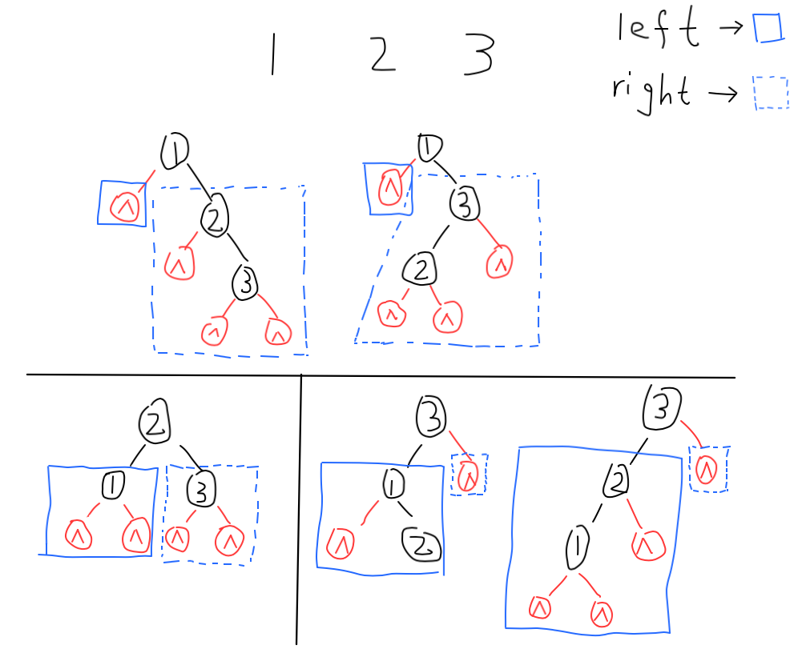

## 分治法

#### 0. 分治法的思路

将一个大问题分成若干个小问题，对较小子问题进行求解。（二分搜索、二分归并排序）

**实现方法：**循环递归，每次递归都要考虑如下三个因素

- 问题分解：原问题是否可以分解为子问题，且子问题的求解方式与原问题相同
- 问题求解：当前子问题是否已经**足够小**且**相互独立**，可以直接进行求解。如果不是，那么继续递归该子问题（**核心部分**）
- 解的合并：子问题的解合并成原问题的解

**注意：**边界条件的控制，这里主要值得是问题求解，是否该问题已经是可以直接求解的子问题了。否则需要继续递归。

#### 1. 给表达式添加括号

[LeetCode 241. Different Ways to Add Parentheses (Medium)](https://leetcode.com/problems/different-ways-to-add-parentheses/description/)

思路参考[花花酱241](https://www.youtube.com/watch?v=gxYV8eZY0eQ)

字符串表达式可以表达为如下形式：

`A operator_1 B operator_2 C ...`, 利用递归思想，递归出口为当前串只包含一个数字的时候，直接返回该数字。假设当前串被`operator_1`分为左`left`，`right`'右两部分，`left`和`right`的结果需要分别进行类似笛卡尔积的`operator_1`操作。操作的结果需要添加到当前的ans中。最终返回的`ans`就是整个`input`表达式的结果。

这里可以通过添加一个history字典存储已经计算过的结果，下次递归到已经计算过的结果可以直接跳出递归。加速计算速度。

实现方法：递归、lambda表达式

```python
class Solution:
    def __init__(self):
        self.history = {}
        self.ops = {
            '+': lambda x, y: x + y,
            '-': lambda x, y: x - y,
            '*': lambda x, y: x * y
        }

    def diffWaysToCompute(self, input: str) -> List[int]:
        return self.ways(input)
    
    
    def ways(self, sub_input):
        if sub_input in self.history:
            return self.history[sub_input]
        
        ans = []
        
        for i in range(len(sub_input)):
            if sub_input[i] in "+-*":
                ans += [self.ops[sub_input[i]](l, r) for l, r in \
                        itertools.product(self.ways(sub_input[0:i]), \
                                          self.ways(sub_input[i+1:]))]
        # only 1 number and no operators
        if not ans: ans.append(int(sub_input))
        # record history sub_input for future use    
        self.history[sub_input] = ans
        
        return ans
```

#### 2. 所有可能形态的二叉搜索树

[LeetCode 95. Unique Binary Search Trees II (Medium)](https://leetcode.com/problems/unique-binary-search-trees-ii/description/)

分治思想，递归实现。

思路：当`n=3`的时候，考虑构成二叉树的形态。`1, 2, 3`每一个数都有作为根节点的权利。如下图所示。由于二叉搜索树的性质，和本题的条件可知，当`1`为根节点时，左子树所有节点值一定比1小，那么左子树一定为`None`。右子树所有节点值一定比`1`大，而右子树根节点的选择有两种可能，需要分别讨论（讨论的区间为`[2 3]`,讨论的过程又是一个递归：`2`和`3`都有作为根节点的权利）。最后将子树集合（子树是一个集合形态，如下图第一行两个右子树（蓝色虚线框））分别接到当前节点`1`的两侧，那么就构成了所有`1`为根节点的情形。同理，对每个节点都进行此操作即可。最后返回的`res`包含了树的所有形态。



```python
# Definition for a binary tree node.
# class TreeNode:
#     def __init__(self, val=0, left=None, right=None):
#         self.val = val
#         self.left = left
#         self.right = right
class Solution:
    def generateTrees(self, n: int) -> List[TreeNode]:
        if n == 0: return None
        return self.generateSubTrees(1, n)
        
    def generateSubTrees(self, start, end):
        if start > end: return [None]
        res = []
        for i in range(start, end+1):
            left = self.generateSubTrees(start, i - 1)
            right = self.generateSubTrees(i + 1, end)
            for a in left:
                for b in right:
                    node = TreeNode(i)
                    node.left = a
                    node.right =b
                    res.append(node)
        return res
```

