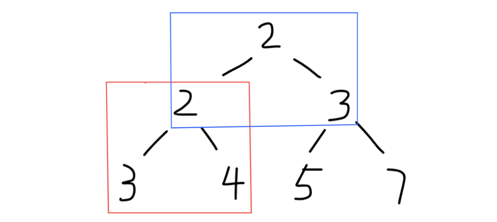

## 递归

> 树是一种常用递归操作的数据结构。一棵树要么是空，要么有两个指针，指向另外两棵树。

#### 1. 树的高度

[Leet Code 104. Maximun Depth of Binary Tree (Easy)](https://leetcode.com/problems/maximum-depth-of-binary-tree/description/)

```python
# Definition for a binary tree node.
# class TreeNode:
#     def __init__(self, val=0, left=None, right=None):
#         self.val = val
#         self.left = left
#         self.right = right
class Solution:
    def maxDepth(self, root: TreeNode) -> int:
        if root == None: return 0
        return max(self.maxDepth(root.left), self.maxDepth(root.right)) + 1
```

#### 2. 平衡树（AVL）

[LeetCode 110. Balanced BInary Tree (Easy)]()

平衡二叉树的判断，是进一步对数的高度的计算。

```python
# Definition for a binary tree node.
# class TreeNode:
#     def __init__(self, val=0, left=None, right=None):
#         self.val = val
#         self.left = left
#         self.right = right
class Solution:
    def __init__(self):
        self.result = True
        
    def isBalanced(self, root: TreeNode) -> bool:
        self.maxDepth(root)
        return self.result

    def maxDepth(self, root):
        if not root: return 0
        lD = self.maxDepth(root.left)
        rD = self.maxDepth(root.right)
        if abs(lD - rD) > 1: self.result = False
        return 1 + max(lD, rD)
```

#### 3. 树上两节点的最长路径

[LeetCode 543. Diameter of Binary Tree (Easy)](https://leetcode.com/problems/diameter-of-binary-tree/description/)

```python
# Definition for a binary tree node.
# class TreeNode:
#     def __init__(self, val=0, left=None, right=None):
#         self.val = val
#         self.left = left
#         self.right = right
class Solution:
    def __init__(self):
        self.subDepth = 0
    
    def diameterOfBinaryTree(self, root: TreeNode) -> int:
        self.calSubDepth(root)
        return self.subDepth
    
    def calSubDepth(self, root):
        if not root: return 0
        leftD = self.calSubDepth(root.left)
        rightD = self.calSubDepth(root.right)
        
        self.subDepth = max(self.subDepth, leftD + rightD)
        return max(leftD, rightD) + 1
```


#### 4. 翻转树

[LeetCode 226. Invert Binary Tree (Easy)](https://leetcode.com/problems/invert-binary-tree/description/)

```python
# Definition for a binary tree node.
# class TreeNode:
#     def __init__(self, val=0, left=None, right=None):
#         self.val = val
#         self.left = left
#         self.right = right
class Solution:
    def invertTree(self, root: TreeNode) -> TreeNode:
        if not root: return None
        left = root.left
        root.left = self.invertTree(root.right)
        root.right = self.invertTree(left)
        return root
```

#### 5. 归并两棵树

[LeetCode 617. Merge Two Binary Trees (Easy)](https://leetcode.com/problems/merge-two-binary-trees/description/)

```python
# Definition for a binary tree node.
# class TreeNode:
#     def __init__(self, val=0, left=None, right=None):
#         self.val = val
#         self.left = left
#         self.right = right
class Solution:
    def mergeTrees(self, t1: TreeNode, t2: TreeNode) -> TreeNode:
        if not t1: return t2
        if not t2: return t1
        if not t1 and not t2: return None
        
        t1.val += t2.val
        t1.left = self.mergeTrees(t1.left, t2.left)
        t1.right = self.mergeTrees(t1.right, t2.right)
        return t1
```

#### 6. 判断路径和是否等于一个数

[LeetCode 112. Path Sum (Easy)](https://leetcode.com/problems/path-sum/description/)

题目中的加法，在递归过程中被转换成了减法，随着递归的进行，最后比较叶节点的值就可以判断是否存在Sum了。

```python
# Definition for a binary tree node.
# class TreeNode:
#     def __init__(self, val=0, left=None, right=None):
#         self.val = val
#         self.left = left
#         self.right = right
class Solution:
    def hasPathSum(self, root: TreeNode, sum: int) -> bool:
        if not root: return False
        if not root.left and not root.right and root.val == sum: return True
        return self.hasPathSum(root.left, sum - root.val) or self.hasPathSum(root.right, sum - root.val)
```

#### 7. 统计路径和为给定值的路径数量

[LeetCode 437. Path Sum III](https://leetcode.com/problems/path-sum-iii/description/)

两个函数互相递归调用。

与6不同的是：6可以从根节点开始就对下一次递归进行sum减法操作。而本题，在进行下一层节点的递归时候，不可以改变sum的值。可以考虑为下一层节点为根节点。相当于遍历每一个节点的时候，都是一次问题6的操作。只是`pathSumStartWithRoot()`的退出条件不是叶节点，而是空节点。这里res用来记录遍历过程中的结果。

此题需要慢慢理解，两个递归函数是如何协调作用的。

```python
# Definition for a binary tree node.
# class TreeNode:
#     def __init__(self, val=0, left=None, right=None):
#         self.val = val
#         self.left = left
#         self.right = right
class Solution:
    def pathSum(self, root: TreeNode, sum: int) -> int:
        if not root: return 0
        res = self.pathSumStartWithRoot(root, sum) + self.pathSum(root.left, sum) + self.pathSum(root.right, sum)
        return res
        
    def pathSumStartWithRoot(self, root, sum):
        if not root: return 0
        res = 0
        if root.val == sum: res += 1
        res += self.pathSumStartWithRoot(root.left, sum - root.val) + self.pathSumStartWithRoot(root.right, sum - root.val)
        return res
```

#### 8. 子树

[LeetCode 572. Subtree of Another Tree](https://leetcode.com/problems/subtree-of-another-tree/submissions/)

整体思路和上一题很像。区别在于上一题是数字的计算，本题是布尔值的判断

```python
# Definition for a binary tree node.
# class TreeNode:
#     def __init__(self, val=0, left=None, right=None):
#         self.val = val
#         self.left = left
#         self.right = right
class Solution:
    def isSubtree(self, s: TreeNode, t: TreeNode) -> bool:
        if not s: return False
        return self.sameJudge(s, t) or self.isSubtree(s.left, t) or self.isSubtree(s.right, t)
        
        
    def sameJudge(self, s, t):
        if not s and not t: return True
        if not s or not t: return False
        
        if s.val != t.val: return False
        return self.sameJudge(s.left, t.left) and self.sameJudge(s.right, t.right)
```

#### 9. 树的对称

[LeetCode 101. Symmetric Tree (Easy)](https://leetcode.com/problems/symmetric-tree/description/)

```python
# Definition for a binary tree node.
# class TreeNode:
#     def __init__(self, val=0, left=None, right=None):
#         self.val = val
#         self.left = left
#         self.right = right
class Solution:
    def isSymmetric(self, root: TreeNode) -> bool:
        if not root: return True
        return self.subTreeJudge(root.left, root.right)
        
    def subTreeJudge(self, t1, t2):
        if not t1 and not t2: return True
        if not t1 or not t2: return False
        if t1.val != t2.val: return False
        return self.subTreeJudge(t1.left, t2.right) and self.subTreeJudge(t1.right, t2.left)
```

#### 10. 最小路径

[LeetCode 111. Minimum Depth of Binary Tree(Easy)](https://leetcode.com/problems/minimum-depth-of-binary-tree/description/)

```python
# Definition for a binary tree node.
# class TreeNode:
#     def __init__(self, val=0, left=None, right=None):
#         self.val = val
#         self.left = left
#         self.right = right
class Solution:
    def minDepth(self, root: TreeNode) -> int:
        if not root: return 0
        left = self.minDepth(root.left)
        right = self.minDepth(root.right)
        # 当左右子树一个为空时候，深度为另一课数的深度+1
        if left == 0 or right == 0: return left + right + 1
        # 当两子树都不为空的时候，返回潜的那棵树长度+1
        return min(left, right) + 1
```

#### 11. 统计左叶节点值的和

[LeetCode 404. Sum of Left Leaves (Easy)](https://leetcode.com/problems/sum-of-left-leaves/submissions/)

```python
# Definition for a binary tree node.
# class TreeNode:
#     def __init__(self, val=0, left=None, right=None):
#         self.val = val
#         self.left = left
#         self.right = right
class Solution:
    def sumOfLeftLeaves(self, root: TreeNode) -> int:
        if not root: return 0
        if self.isLeave(root.left): return root.left.val + self.sumOfLeftLeaves(root.right)
        return self.sumOfLeftLeaves(root.left) + self.sumOfLeftLeaves(root.right)
        
    def isLeave(self, root):
        if not root: return False
        if not root.left and not root.right: return True
```

#### 12. 相同节点值的最大路径长度

[LeetCode 687. Longest Univalue Path (Easy)](https://leetcode.com/problems/longest-univalue-path/)

```python
# Definition for a binary tree node.
# class TreeNode:
#     def __init__(self, val=0, left=None, right=None):
#         self.val = val
#         self.left = left
#         self.right = right
class Solution:
    def __init__(self):
        self.length = 0
    
    def longestUnivaluePath(self, root: TreeNode) -> int:
        self.dfs(root)
        return self.length
        
    def dfs(self, root):
        if not root: return 0
        
        left = self.dfs(root.left)
        right = self.dfs(root.right)
        
        left_len = left + 1 if root.left and root.left.val == root.val else 0
        right_len = right + 1 if root.right and root.right.val == root.val else 0
        
        self.length = max(self.length, left_len + right_len)
        return max(left_len, right_len)
```

#### 13. 间隔遍历

[LeetCode 337. House Robber III (Medium)](https://leetcode.com/problems/house-robber-iii/description/)

```python
# 此方法Time Out，超时的原因应该是，一个函数内部竟然需要调用6次递归函数。
# 通过添加字典记录已经计算过的节点，节省运算时间

# Definition for a binary tree node.
# class TreeNode:
#     def __init__(self, val=0, left=None, right=None):
#         self.val = val
#         self.left = left
#         self.right = right
class Solution:
    def __init__(self):
        self.history = {}
        
    def rob(self, root: TreeNode) -> int:
        if not root: return 0
        if root in self.history:
            return self.history[root]
        total1 = root.val
        
        if root.left:
            total1 += self.rob(root.left.left) + self.rob(root.left.right)
        if root.right:
            total1 += self.rob(root.right.left) + self.rob(root.right.right)
        
        total2 = self.rob(root.left) + self.rob(root.right)
        res = max(total1, total2)
        self.history[root] = res
        return res
# 下面方法和上面思路有一点小差异，递归函数返回三个值，（当前节点值，左孩子节点值，右孩子节点值）
# (root.left节点的值, root.left.left节点值, root.left.right节点值)
class Solution:
    def rob(self, root: TreeNode) -> int:
        return self.myrob(root)[0]
        
    def myrob(self, root):
        if not root: return 0, 0, 0
        l, ll, lr = self.myrob(root.left)
        r, rl, rr = self.myrob(root.right)
        # 第一个返回值很好理解，后面两个l, r不太容易理解，这里由于函数向上一层返回，即本层节点的左孩子l一定是上层函数的ll, 本层节点的r, 一定是上层函数的lr
        return max(root.val + ll + lr + rl + rr, l + r), l, r
```


#### 14. 找出二叉树中第二小的节点

[LeetCode 671. Second Minimum Node In a Binary Tree (Easy)](https://leetcode.com/problems/second-minimum-node-in-a-binary-tree/description/)



考虑上图二叉树。由于该题目的特性可知：父节点总是**小于等于**孩子节点。如果不考虑等于的情况最小值一定出现在父节点上（如红色框框所示）。那么第二小的值一定出现在左右孩子中的一个。可能是左孩子的值，也可能是右孩子的值。也可能是-1.

那么考虑最简单的树，红色框框的树。如果父节点和子节点值都不同，那么第二小的值一定是子节点中值较小的那个。如果父节点和其中一个子节点值相同（假设是左子节点，如蓝色框框所示）。由于父节点一般记录的是最小的值，现在左子节点与其相同了，那么第二小的节点就可能存在于左子树中，这时候递归左子树去寻找该值。同理递归右子树。

最终3中情况返回：

1. 如果左右孩子节点均有子树，返回左右孩子节点中较小的那个值即整棵树第二小的值（红色框框的情形）
2. 如果左孩子没子树，则返回左孩子节点的值
3. 否则返回右孩子节点的值

```python
# Definition for a binary tree node.
# class TreeNode:
#     def __init__(self, val=0, left=None, right=None):
#         self.val = val
#         self.left = left
#         self.right = right
class Solution:
    def findSecondMinimumValue(self, root: TreeNode) -> int:
        if not root: return -1
        if not root.left and not root.right: return -1
        
        left = root.left.val
        right = root.right.val
        
        # if value same as root val, need to find the next candidate
        if root.left.val == root.val:
            left = self.findSecondMinimumValue(root.left)
        if root.right.val == root.val:
            right = self.findSecondMinimumValue(root.right)
            
        if left != -1 and right != -1:
            return min(left, right)
        elif left != -1:
            return left
        else:
            return right
```

## 层次遍历

> 层次遍历是图的一种广度优先搜索。BFS。需要使用队列数据结构来辅助搜索过程。

#### 1. 一棵树每层节点的平均数

[LeetCode 637. Average of Levels in Binary Tree(Easy)](https://leetcode.com/problems/average-of-levels-in-binary-tree/description/)

每层节点需要在队列中间插入一个hint信息。隔离层与层之间的数据。这里使用`end`作为hint标记。当`end`出队列的时候，意味着前一层节点全部遍历完毕，那么当前队头到队尾的均为下一层的节点。此时在队的末尾再添加一个`end`标记，用以隔离下一层元素。

```python
# Definition for a binary tree node.
# class TreeNode:
#     def __init__(self, val=0, left=None, right=None):
#         self.val = val
#         self.left = left
#         self.right = right
class Solution:
    def averageOfLevels(self, root: TreeNode) -> List[float]:
        Q = [root]
        Q.append('end')
        res = []
        
        sum, n = 0, 0
        while Q:
            if Q[0] != 'end':
                sum += Q[0].val
                n += 1
                if Q[0].left: Q.append(Q[0].left)
                if Q[0].right: Q.append(Q[0].right)
                del Q[0]
            else:
                res.append(sum/n)
                del Q[0]
                if not Q: break
                Q.append('end')
                sum, n = 0, 0
        return res
```

#### 2. 得到左下角的节点值

[LeetCode 513. Find Bottom Left Tree Value(Easy)](https://leetcode.com/problems/find-bottom-left-tree-value/description/)

层次遍历先访问右子树再访问左子树，得到的最后一个结果就是所求结果。

```python
# Definition for a binary tree node.
# class TreeNode:
#     def __init__(self, val=0, left=None, right=None):
#         self.val = val
#         self.left = left
#         self.right = right
class Solution:
    def findBottomLeftValue(self, root: TreeNode) -> int:
        Q = []
        Q.append(root)
        
        while Q:
            res = Q[0].val
            if Q[0].right: Q.append(Q[0].right)
            if Q[0].left: Q.append(Q[0].left)
            del Q[0]
        return res
```

## 前序、中序、后续遍历

#### 前序遍历

```python
def preOrder(root):
    if not root: return
    visit(root.val)
    preOrder(root.left)
    preOrder(root.right)
```

#### 中序遍历

```python
def inOrder(root):
    if not root: return
    inOrder(root.left)
    visit(root.val)
    inOrder(root.right)
```

#### 后序遍历

```python
def postOrder(root):
    if not root: return
    postOrder(root.left)
    postOrder(root.right)
    visit(root.val)
```

#### 1. 非递归实现二叉树的前序遍历

[LeetCode 144. Binary Tree Preorder Traversal (Medium)](https://leetcode.com/problems/binary-tree-preorder-traversal/)

二叉树的非递归前序遍历，通过借助栈先进后出（FILO）的特性实现。

```python
# Definition for a binary tree node.
# class TreeNode:
#     def __init__(self, val=0, left=None, right=None):
#         self.val = val
#         self.left = left
#         self.right = right
class Solution:
    def preorderTraversal(self, root: TreeNode) -> List[int]:
        if not root: return []
        stack, res = [], []

        stack.append(root)
        
        while stack:
            cur = stack.pop()
            res.append(cur.val)
            if cur.right: stack.append(cur.right)
            if cur.left: stack.append(cur.left)
        
        return res
```

#### 2. 非递归实现二叉树的后序遍历

[LeetCode 145. Binary Tree Postorder Traversal (Hard)](https://leetcode.com/problems/binary-tree-postorder-traversal/)

前序遍历顺序为：`root -> left -> right`，后序遍历顺序为：`left -> right -> root`。非递归实现后续遍历，有一个小技巧。如果将前序遍历改成`root -> right -> left`，那么逆序这个遍历顺序，就是后序遍历。

如果不使用这个小技巧的方法，我还不知道。。。哈哈

```python
# Definition for a binary tree node.
# class TreeNode:
#     def __init__(self, val=0, left=None, right=None):
#         self.val = val
#         self.left = left
#         self.right = right
class Solution:
    def postorderTraversal(self, root: TreeNode) -> List[int]:
        if not root: return []
        stack, res = [], []
        
        stack.append(root)
        
        while stack:
            cur = stack.pop()
            res.append(cur.val)
            if cur.left: stack.append(cur.left)
            if cur.right: stack.append(cur.right)
            
        return reversed(res)
```

#### 3. 非递归实现二叉树的中序遍历

[LeetCode 97. Binary Tree Inorder Traversal (Medium)](https://leetcode.com/problems/binary-tree-inorder-traversal/description/)

实现思路：如果当前节点不为空，或者当前栈不空，当前节点入栈，当前节点指向其左子树位置（寻找数的最左边节点）。从栈中依次弹出一个节点进行访问，并将当前节点指向其右子树的位置，循环进行。

```python
# Definition for a binary tree node.
# class TreeNode:
#     def __init__(self, val=0, left=None, right=None):
#         self.val = val
#         self.left = left
#         self.right = right
class Solution:
    def inorderTraversal(self, root: TreeNode) -> List[int]:
        if not root: return []
        stack, res = [], []
        current = root
        
        while current or stack:
            while current:
                stack.append(current)
                current = current.left
                
            node = stack.pop()
            res.append(node.val)
            current = node.right
        return res
```

## BST 二叉搜索树

二叉搜索树的性质：

- 根节点的值大于等于左子树的所有节点值，小于等于右子树的所有节点值
- 二叉搜索树的中序遍历是一个递增序列

#### 1. 修剪二叉搜索树

[LeetCode 669. Trim a Binary Search Tree (Easy)](https://leetcode.com/problems/trim-a-binary-search-tree/description/)

修剪结果无非有三种情形

1. `L < root.val < R`
2. `root.val > R`
3. `root.val < L`

```python
# Definition for a binary tree node.
# class TreeNode:
#     def __init__(self, val=0, left=None, right=None):
#         self.val = val
#         self.left = left
#         self.right = right
class Solution:
    def trimBST(self, root: TreeNode, L: int, R: int) -> TreeNode:
        if not root: return 
        if root.val > R:
            root = self.trimBST(root.left, L, R)
        elif root.val < L:
            root = self.trimBST(root.right, L, R)
        else:
            root.left = self.trimBST(root.left, L, R)
            root.right = self.trimBST(root.right, L, R)
        return root
```

#### 2. 寻找二叉搜索树的第k个元素

中序遍历BST结果是一个升序序列。设置递归函数外的变量记录递归过程即可实现计数第k个元素。

```python
# Definition for a binary tree node.
# class TreeNode:
#     def __init__(self, val=0, left=None, right=None):
#         self.val = val
#         self.left = left
#         self.right = right
class Solution:
    def kthSmallest(self, root: TreeNode, k: int) -> int:
        self.k = k
        self.res = 0
        self.dfs(root)
        return self.res
        
    def dfs(self, root):
        if root != None:
            self.dfs(root.left)
            self.k -= 1
            if self.k == 0:
                self.res = root.val
            self.dfs(root.right)
```

#### 3. 把二叉搜索树的每个节点的值都加上比他大的节点的值

BST中序遍历是一个升序序列，那么先访问右子树再访问左子树的中序遍历就是一个降序序列。降序序列第一个数的值不停的加到一个sum变量中，以后每次遍历数值都增加该数。

```python
# Definition for a binary tree node.
# class TreeNode:
#     def __init__(self, val=0, left=None, right=None):
#         self.val = val
#         self.left = left
#         self.right = right
class Solution:
    def convertBST(self, root: TreeNode) -> TreeNode:
        self.sum = 0
        self.dfs(root)
        return root
        
    def dfs(self, root):
        if not root: return
        self.dfs(root.right)
        self.sum += root.val
        root.val = self.sum
        self.dfs(root.left)
```

#### 4. 二叉树的最近公共祖先（Binary Tree）

[LeetCode 236. Lowest Common Ancestor of a Binary Tree](https://leetcode.com/problems/lowest-common-ancestor-of-a-binary-tree/)

递归总是需要考虑最小子问题的情形！！！这里指的是三个节点的数的一般情况。

**每一次递归，都只是对一个最小二层树的判断**，没有遇到p或q之前，返回的都是None。因此最后的三个if判断是包括了所有的情形。

```python
# Definition for a binary tree node.
# class TreeNode:
#     def __init__(self, x):
#         self.val = x
#         self.left = None
#         self.right = None

class Solution:
    def lowestCommonAncestor(self, root: 'TreeNode', p: 'TreeNode', q: 'TreeNode') -> 'TreeNode':
        if not root: return None
        if root == p or root == q: return root
        
        left = self.lowestCommonAncestor(root.left, p, q)
        right = self.lowestCommonAncestor(root.right, p, q)
        
        if not left: return right
        elif not right: return left
        else: return root
```

#### 5. 二叉搜索树的最近公共祖先（Binary Search Tree）

[LeetCode 235. Lowest Common Ancestor of a Binary Search Tree (Easy)](https://leetcode.com/problems/lowest-common-ancestor-of-a-binary-search-tree/description/)

遇上一题不同之处在于，这是一个二叉搜索树且没有重复节点。搜索树总是有`root.val > root.left, root.val < root.right`.

```python
# Definition for a binary tree node.
# class TreeNode:
#     def __init__(self, x):
#         self.val = x
#         self.left = None
#         self.right = None

class Solution:
    def lowestCommonAncestor(self, root: 'TreeNode', p: 'TreeNode', q: 'TreeNode') -> 'TreeNode':
        if root.val > p.val and root.val > q.val:
            return self.lowestCommonAncestor(root.left, p, q)
        if root.val < p.val and root.val < q.val:
            return self.lowestCommonAncestor(root.right, p, q)
        return root
```

#### 6. 从有序数组中构造二叉搜索树

[LeetCode 108. Convert Sorted Array to Binary Search Tree (Easy)](https://leetcode.com/problems/convert-sorted-array-to-binary-search-tree/description/)

将有序数组分成三个部分，分别递归构建这三个部分。

```python
# Definition for a binary tree node.
# class TreeNode:
#     def __init__(self, val=0, left=None, right=None):
#         self.val = val
#         self.left = left
#         self.right = right
class Solution:
    def sortedArrayToBST(self, nums: List[int]) -> TreeNode:
        return self.buildBST(nums, 0, len(nums)-1)
        
    def buildBST(self, nums, l, r):
        if l > r: return None
        m = l + (r - l) // 2
        
        root = TreeNode(nums[m])
        root.left = self.buildBST(nums, l, m-1)
        root.right = self.buildBST(nums, m+1, r)
        
        return root
```

#### 7. 根据有序链表构造平衡二叉搜索树

[LeetCode 109. Convert Sorted List to Binary Search Tree (Medium)](https://leetcode.com/problems/convert-sorted-list-to-binary-search-tree/description/)

与上一题是同类型题，这里使用快慢指针方法寻找链表的中间节点。将链表分为三个部分。

```python
# Definition for singly-linked list.
# class ListNode:
#     def __init__(self, val=0, next=None):
#         self.val = val
#         self.next = next
# Definition for a binary tree node.
# class TreeNode:
#     def __init__(self, val=0, left=None, right=None):
#         self.val = val
#         self.left = left
#         self.right = right
class Solution:
    def sortedListToBST(self, head: ListNode) -> TreeNode:
        if not head: return None
        if not head.next: return TreeNode(head.val)
        
        mid = self.findM(head)
        
        root = TreeNode(mid.val)
        root.left = self.sortedListToBST(head)
        root.right = self.sortedListToBST(mid.next)
        
        return root
        
    def findM(self, head) -> ListNode:
        slow = fast = head
        prev = None
        while fast and fast.next:
            prev = slow
            slow = slow.next
            fast = fast.next.next
        prev.next = None
        return slow
```


#### 8. 判断二叉搜索树中是否存在两个节点，使他们和为给定值

中序遍历得到一个单调递增数组，用滑动窗口思想，left，right分别指向列表两段，向中间滑动。依次两段向中间滑动计算两个数的和。

```python
# Definition for a binary tree node.
# class TreeNode:
#     def __init__(self, val=0, left=None, right=None):
#         self.val = val
#         self.left = left
#         self.right = right
class Solution:
    def __init__(self):
        self.nums = []
        
    def findTarget(self, root: TreeNode, k: int) -> bool:
        self.inOrder(root)
        total, left, right = 0, 0, len(self.nums)-1
        
        while left < right:
            total = self.nums[left] + self.nums[right]
            if total == k: return True
            if total < k: left += 1
            else: right -= 1
        return False
        
        
    def inOrder(self, root):
        if not root: return 
        self.inOrder(root.left)
        self.nums.append(root.val)
        self.inOrder(root.right)
```

#### 9. 在二叉搜索树中查找两个节点之差的最小绝对值

[LeetCode 530. Minimum Absolute Difference in BST (Easy)](https://leetcode.com/problems/minimum-absolute-difference-in-bst/description/)

利用二叉搜索树中序遍历是单调递增序列的性质，在中序遍历过程中，记录prev节点信息，遍历到每一个节点的同时计算与prev节点的差值。

```python
# Definition for a binary tree node.
# class TreeNode:
#     def __init__(self, val=0, left=None, right=None):
#         self.val = val
#         self.left = left
#         self.right = right
class Solution:
    def __init__(self):
        self.minimum = float('inf')
        self.prev = None
    
    def getMinimumDifference(self, root: TreeNode) -> int:
        self.inOrder(root)
        return self.minimum
    
    def inOrder(self, root):
        if not root: return
        self.inOrder(root.left)
        
        if self.prev:
            self.minimum = min((root.val - self.prev.val), self.minimum)
        self.prev = root
        
        self.inOrder(root.right)
```

#### 10. 寻找二叉搜索树中出现次数最多的值

[LeetCode 501. Find Mode in Binary Search Tree (Easy)](https://leetcode.com/problems/find-mode-in-binary-search-tree/description/)

此问题是上一问题的扩展。程序整体框架没有发生过大的改变。

```python
# Definition for a binary tree node.
# class TreeNode:
#     def __init__(self, val=0, left=None, right=None):
#         self.val = val
#         self.left = left
#         self.right = right
class Solution:
    def __init__(self):
        self.res = []
        self.maxTimes = 1
        self.times = 1
        self.prev = None
    
    def findMode(self, root: TreeNode) -> List[int]:
        self.inOrder(root)
        return self.res
        
        
    def inOrder(self, root):
        if not root: return
        self.inOrder(root.left)
        
        if self.prev:
            if root.val == self.prev.val:
                self.times += 1
            else:
                self.times = 1
                
        if self.times > self.maxTimes:
            self.maxTimes = self.times
            self.res.clear()
            self.res.append(root.val)
        elif self.times == self.maxTimes:
            self.res.append(root.val)
            
        self.prev = root
        
        self.inOrder(root.right)
```

## Trie 前缀树

> **前缀树**又称为**字典树**，用于判断字符串是否存在相同前缀

#### 1. 实现一个Trie

这里使用字典来存储前缀树。树的根节点是一个空字典。详细信息可以参考博客文章[构建字典树](https://blog.csdn.net/weixin_46391502/article/details/106128062)。

```python
class Trie:
    def __init__(self):
        """
        Initialize your data structure here.
        """
        self.root = {}
        self.word_end = -1

    def insert(self, word: str) -> None:
        """
        Inserts a word into the trie.
        """
        curNode = self.root
        for c in word:
            if c not in curNode:
                curNode[c] = {}
            curNode = curNode[c]
            
        curNode[self.word_end] = True

    def search(self, word: str) -> bool:
        """
        Returns if the word is in the trie.
        """
        curNode = self.root
        for c in word:
            if c not in curNode:
                return False
            curNode = curNode[c]
        # Check if curNode has end flag now.
        if self.word_end not in curNode:
            return False
        return True

    def startsWith(self, prefix: str) -> bool:
        """
        Returns if there is any word in the trie that starts with the given prefix.
        """
        curNode = self.root
        for c in prefix:
            if c not in curNode:
                return False
            curNode = curNode[c]
        return True
# Your Trie object will be instantiated and called as such:
# obj = Trie()
# obj.insert(word)
# param_2 = obj.search(word)
# param_3 = obj.startsWith(prefix)
```

#### 2. 实现一个前缀Trie，求前缀和

创建两个字典，一个用来存储字典形式的**前缀树**，一个用来存储该字符串key是否已经存在。

```python
# Runtime: 16ms
# Memory Usage: 13.8MB
class MapSum:
    def __init__(self):
        """
        Initialize your data structure here.
        """
        self.root = {}
        self.history = {}

    def insert(self, key: str, val: int) -> None:
        curr = self.root
        
        if key not in self.history:
            self.history[key] = val
            for ch in key:
                if ch not in curr:
                    curr[ch] = {'time': val}
                else:
                    curr[ch]['time'] += val
                curr = curr[ch]
        else:
            for ch in key:
                curr[ch]['time'] += (val - self.history[key])
                curr = curr[ch]
    # 任何一个字符不存在都返回0值
    def sum(self, prefix: str) -> int:
        curr = self.root
        for ch in prefix:
            if ch not in curr:
                return 0
            else:
                curr = curr[ch]
        return curr['time']
```