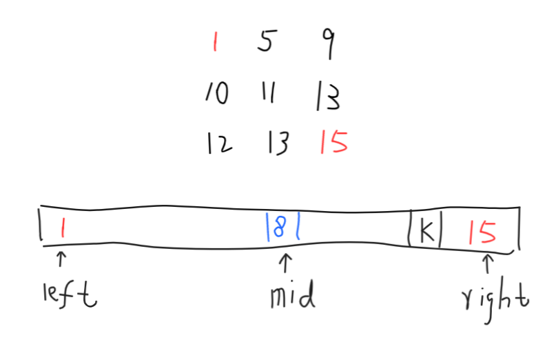

## 数组与矩阵

#### 1. 把数组中的0移动到末尾

[LeetCode 283. Move Zeros (Easy)](https://leetcode.com/problems/move-zeroes/description/)

设置一个索引notZeroPoint，开始指向列表的开头位置。我们遍历数组，寻找非0元素，将非0元素按顺序依次记录在索引notZeroPoint中。遍历结束后，所有的非0元素都按元顺序排列在了列表的前面。剩下将后面位置补0即可。

```python
class Solution:
    def moveZeroes(self, nums: List[int]) -> None:
        """
        Do not return anything, modify nums in-place instead.
        """
        notZeroPoint = 0
        
        for item in nums:
            if item != 0:
                nums[notZeroPoint] = item
                notZeroPoint += 1
                
        while notZeroPoint < len(nums):
            nums[notZeroPoint] = 0
            notZeroPoint += 1
```

#### 2. 改变矩阵维度

[LeetCode 566. Reshape the Matrix (Easy)](https://leetcode.com/problems/reshape-the-matrix/description/)

首先判断矩阵输入元素数量是否可以生成新的矩阵维度，如果不能直接返回原矩阵。接下来就双层循环，依次添加到新的列表中即可（中间设置i变量统计每行的列数。）时间复杂度为$O(m*n)$

```python
class Solution:
    def matrixReshape(self, nums: List[List[int]], r: int, c: int) -> List[List[int]]:
        old_r = len(nums)
        old_c = len(nums[0])
        ret, i, temp_row = [], 0, []
        
        if old_r * old_c != r * c:
            return nums
        
        for x in nums:
            for y in x:
                temp_row.append(y)
                i += 1
                if i % c == 0:
                    ret.append(temp_row)
                    temp_row = []
        return ret
```

#### 3. 数组中最长的连续1

[LeetCode 485. Max Consecutive Ones (Easy)](https://leetcode.com/problems/max-consecutive-ones/description/)

直接遍历列表，如果遇到0直接重置当前tmpLen的长度为0.如果遇到1，那么对tmpLen进行加1操作。如果当前值比最大值要大，那么更新最大值。

```python
class Solution:
    def findMaxConsecutiveOnes(self, nums: List[int]) -> int:
        maxLen, tmpLen = 0, 0
        
        for index in range(len(nums)):
            if nums[index] == 1:
                tmpLen += 1
                if tmpLen > maxLen: maxLen = tmpLen
            else:
                tmpLen = 0
                
        return maxLen
```

#### 4. 有序矩阵查找

[LeetCode 240. Search a 2D Matrix II (Medium)](https://leetcode.com/problems/search-a-2d-matrix-ii/description/)

从第一行的末尾开始向下搜索，如果当前值比target小，那么寻找下一行。如果当前与target相等，返回True，如果当前值比target大，那么寻找前一列的值。

本题如果是从左向右搜索的话，需要增加许多判断条件。因为从右向左搜索，判断目标比当前值小，那么搜索其下一行值，目标比当前值大，那么搜索其左列值；若从左向右搜索，目标比当前值大，但是当前元素👉右边和👇下面值都有可能存在，需要判断搜索的走向。

```python
class Solution:
    def searchMatrix(self, matrix, target):
        """
        :type matrix: List[List[int]]
        :type target: int
        :rtype: bool
        """
        if not matrix or len(matrix) == 0 or len(matrix[0]) == 0: return False
        row_len = len(matrix)
        col_len = len(matrix[0])
        row, col = 0, col_len-1
        
        while row < row_len and col >= 0:
            if matrix[row][col] == target:
                return True
            elif matrix[row][col] > target:
                col -= 1
            else:
                row += 1
        return False
```

#### 5. 有序矩阵查找第K小的元素

[LeetCode 378. Kth Smallest Element in a Sorted Matrix (Medium)](https://leetcode.com/problems/kth-smallest-element-in-a-sorted-matrix/)

方法一：（暴力排序）

如果使用内置函数将matrix转换为1维列表，对列表排序，去第k个值即可。此方法时间复杂度取决于排序算法。

方法二：二分查找

由于矩阵并不是真正的单调序列，不可以直接使用二分搜索。但是该问题可以利用二分搜索的思想。该数组一定有最小值和最大值，分别在数组的左上角和右下角。那么我们要找的数一定是他们之间的一个数。假设他们之间是递增的序列，那么一定可以使用二分搜索找到这个值。设置left, right, mid三个变量，二分搜索left、right不断逼近mid。mid就是我们要找的答案。

如下图例子所示，left = 1, right = 15, mid = (left + right) // 2 = 8。我们在矩阵中统计比mid小的数的数量count，如果count数量小于k，那么意味着，mid偏小了，不足以覆盖k个比他小的值，换而言之mid不是第k小的数。我们寻找的mid一定在右边。为了将mid变大，这时候将left移动到mid+1的位置。同理，如果count数量大于等于k，意味着mid偏大了，这时候将right移动到mid的位置。循环终止条件是left>right的时候。那么此时right就是我们要寻找的值。



```python
# 方法一
class Solution:
    def kthSmallest(self, matrix: List[List[int]], k: int) -> int:
        return sorted(sum(matrix,[]))[k-1]
    
# 方法二
# Runtime: 160ms
# Memory Usage: 19.7 MB
class Solution:
    def kthSmallest(self, matrix: List[List[int]], k: int) -> int:
        row = len(matrix)
        col = len(matrix[0])
        left, right = matrix[0][0], matrix[row-1][col-1]
        
        while left < right:
            mid = (left + right) // 2
            count = self.findNotBiggerThanMid(matrix, mid, row, col)
            if count < k:
                left = mid + 1
            else:
                right = mid
        return right
    # 从左下角元素开始统计比mid小的元素数量
    def findNotBiggerThanMid(self, matrix, mid, row, col):
        i, j, count = row - 1, 0, 0
        while i >= 0 and j < col:
            if matrix[i][j]  <= mid:
                count += i + 1
                j += 1
            else:
                i -= 1
        return count
```