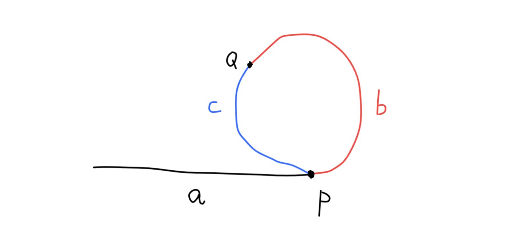

## 数组与矩阵

#### 1. 把数组中的0移动到末尾

[LeetCode 283. Move Zeros (Easy)](https://leetcode.com/problems/move-zeroes/description/)

设置一个索引notZeroPoint，开始指向列表的开头位置。我们遍历数组，寻找非0元素，将非0元素按顺序依次记录在索引notZeroPoint中。遍历结束后，所有的非0元素都按元顺序排列在了列表的前面。剩下将后面位置补0即可。

```python
class Solution:
    def moveZeroes(self, nums: List[int]) -> None:
        """
        Do not return anything, modify nums in-place instead.
        """
        notZeroPoint = 0
        
        for item in nums:
            if item != 0:
                nums[notZeroPoint] = item
                notZeroPoint += 1
                
        while notZeroPoint < len(nums):
            nums[notZeroPoint] = 0
            notZeroPoint += 1
```

#### 2. 改变矩阵维度

[LeetCode 566. Reshape the Matrix (Easy)](https://leetcode.com/problems/reshape-the-matrix/description/)

首先判断矩阵输入元素数量是否可以生成新的矩阵维度，如果不能直接返回原矩阵。接下来就双层循环，依次添加到新的列表中即可（中间设置i变量统计每行的列数。）时间复杂度为$O(m*n)$

```python
class Solution:
    def matrixReshape(self, nums: List[List[int]], r: int, c: int) -> List[List[int]]:
        old_r = len(nums)
        old_c = len(nums[0])
        ret, i, temp_row = [], 0, []
        
        if old_r * old_c != r * c:
            return nums
        
        for x in nums:
            for y in x:
                temp_row.append(y)
                i += 1
                if i % c == 0:
                    ret.append(temp_row)
                    temp_row = []
        return ret
```

#### 3. 数组中最长的连续1

[LeetCode 485. Max Consecutive Ones (Easy)](https://leetcode.com/problems/max-consecutive-ones/description/)

直接遍历列表，如果遇到0直接重置当前tmpLen的长度为0.如果遇到1，那么对tmpLen进行加1操作。如果当前值比最大值要大，那么更新最大值。

```python
class Solution:
    def findMaxConsecutiveOnes(self, nums: List[int]) -> int:
        maxLen, tmpLen = 0, 0
        
        for index in range(len(nums)):
            if nums[index] == 1:
                tmpLen += 1
                if tmpLen > maxLen: maxLen = tmpLen
            else:
                tmpLen = 0
                
        return maxLen
```

#### 4. 有序矩阵查找

[LeetCode 240. Search a 2D Matrix II (Medium)](https://leetcode.com/problems/search-a-2d-matrix-ii/description/)

从第一行的末尾开始向下搜索，如果当前值比target小，那么寻找下一行。如果当前与target相等，返回True，如果当前值比target大，那么寻找前一列的值。

本题如果是从左向右搜索的话，需要增加许多判断条件。因为从右向左搜索，判断目标比当前值小，那么搜索其下一行值，目标比当前值大，那么搜索其左列值；若从左向右搜索，目标比当前值大，但是当前元素👉右边和👇下面值都有可能存在，需要判断搜索的走向。

```python
class Solution:
    def searchMatrix(self, matrix, target):
        """
        :type matrix: List[List[int]]
        :type target: int
        :rtype: bool
        """
        if not matrix or len(matrix) == 0 or len(matrix[0]) == 0: return False
        row_len = len(matrix)
        col_len = len(matrix[0])
        row, col = 0, col_len-1
        
        while row < row_len and col >= 0:
            if matrix[row][col] == target:
                return True
            elif matrix[row][col] > target:
                col -= 1
            else:
                row += 1
        return False
```

#### 5. 有序矩阵查找第K小的元素

[LeetCode 378. Kth Smallest Element in a Sorted Matrix (Medium)](https://leetcode.com/problems/kth-smallest-element-in-a-sorted-matrix/)

方法一：（暴力排序）

如果使用内置函数将matrix转换为1维列表，对列表排序，去第k个值即可。此方法时间复杂度取决于排序算法。

方法二：二分查找

由于矩阵并不是真正的单调序列，不可以直接使用二分搜索。但是该问题可以利用二分搜索的思想。该数组一定有最小值和最大值，分别在数组的左上角和右下角。那么我们要找的数一定是他们之间的一个数。假设他们之间是递增的序列，那么一定可以使用二分搜索找到这个值。设置left, right, mid三个变量，二分搜索left、right不断逼近mid。mid就是我们要找的答案。

如下图例子所示，left = 1, right = 15, mid = (left + right) // 2 = 8。我们在矩阵中统计比mid小的数的数量count，如果count数量小于k，那么意味着，mid偏小了，不足以覆盖k个比他小的值，换而言之mid不是第k小的数。我们寻找的mid一定在右边。为了将mid变大，这时候将left移动到mid+1的位置。同理，如果count数量大于等于k，意味着mid偏大了，这时候将right移动到mid的位置。循环终止条件是left>right的时候。那么此时right就是我们要寻找的值。


```python
# 方法一
class Solution:
    def kthSmallest(self, matrix: List[List[int]], k: int) -> int:
        return sorted(sum(matrix,[]))[k-1]
    
# 方法二
# Runtime: 160ms
# Memory Usage: 19.7 MB
class Solution:
    def kthSmallest(self, matrix: List[List[int]], k: int) -> int:
        row = len(matrix)
        col = len(matrix[0])
        left, right = matrix[0][0], matrix[row-1][col-1]
        
        while left < right:
            mid = (left + right) // 2
            count = self.findNotBiggerThanMid(matrix, mid, row, col)
            if count < k:
                left = mid + 1
            else:
                right = mid
        return right
    # 从左下角元素开始统计比mid小的元素数量
    def findNotBiggerThanMid(self, matrix, mid, row, col):
        i, j, count = row - 1, 0, 0
        while i >= 0 and j < col:
            if matrix[i][j]  <= mid:
                count += i + 1
                j += 1
            else:
                i -= 1
        return count
```

#### 6. 数组中寻找重复数和丢失数

[LeetCode 645. Set Mismatch (Easy)](https://leetcode.com/problems/set-mismatch/description/)

方法一：排序数组

由于列表内的数据是乱序的，且只有一个数据是重复的，那么可以通过交换数据的方式将列表中的数据交换到其正确的位置上去。那么最终一定有一个数字不在自己的正确位置上如下例子所示：

```python
 input: [9, 7, 3, 2, 1, 5, 4, 6, 4]
output: [1, 2, 3, 4, 5, 6, 7, 4, 9]
```

对output进行遍历，判断当前索引位置是否是正确数字，如果不是，那么返回索引值与当前值即可。

需要深刻理解的是while循环的判断条件：当前索引位置的值（假设i为0，索引0对应的值是9），不是对应值（0对应的值应该是1） **并且** 当前位置的值减去1对应的索引值不合理（9-1=8，索引8对应的值应该是9，但是索引8对应的值为4），那么对这两处的索引值交换，一定会破坏and中的一个条件！

```python
class Solution:
    def findErrorNums(self, nums: List[int]) -> List[int]:
        for i in range(len(nums)):
            while nums[i] != i + 1 and nums[nums[i]-1] != nums[i]:
                self.swap(nums, i, nums[i]-1)
            
        for i in range(len(nums)):
            if nums[i] != i + 1:
                return [nums[i], i + 1]
        return []
        
    def swap(self, nums, i, j):
        nums[i], nums[j] = nums[j], nums[i]
```

方法二：使用字典

使用字典判断该数字是否出现，如果该数已经出现，那么他一定是哪个重复的。最后for循环遍历`1 : n`全体，如果在字典中没出现，那么他就是确实的那个。方法比较简单，代码就不给出了。

#### 7. 找出数组中重复的数

[LeetCode 287. Find the Duplicate Number (Medium)](https://leetcode.com/problems/find-the-duplicate-number/description/)

本题如果能使用哈希表就非常容易了。

本题的限制条件如下：

- 给定nums只读
- 空间复杂度要求$O(1)$ （前两条限制不能使用排序算法）
- 时间复杂度小于$O(n^2)$
- 只有一个数是重复的，但是他可能出现多次

**方法一**（二分搜索）

本题使用Binary Search，方法跟**第五题**是一样的。**二分法一共有两种情况，一个是索引二分，一个是值二分。**

分析：

`1, ... , mid-1, mid, mid+1, ... , 99`: 假设n等于99。那么数组中含有100个数，一定至少有一个是重复的。我们求出mid，并统计整个数组中小于mid元素的个数。

如果不存在重复元素，那么小于mid元素的个数一定不会超过mid个。①如果没有超过，那么证明mid偏小了，重复的值可能比mid大，此时left的值应该变为`mid + 1`。②如果超过了，那么说明重复的值一定比mid小。我们应该使mid减小，此时right的值变为`mid - 1 `。

如此循环，最终循环结束。

**方法二**（双指针，快慢指针）

该问题可以抽象成一个链表是否存在环的问题。因为长度为n+1的数组，只存储了n个数，那么一定存在重复的数。如果数组中每个索引中存储的值为其下一个索引序号，那么一定可以形成一个闭合环，如下图所示。



设置两个指针，一个快一个慢。快的每次走两步，慢的每次走一步。他们一定会相遇，假设相遇在Q点（可以采用数学归纳法证明）。fast走过的长度有`a + b + c + b`，slow走过的长度有`a + b`. 他们由于每次循环，快指针走两步，慢指针走一步。那么有$2\times(a+b)=a+b+c+b$，可以得到$a=c$. 此时将fast重新指向开始，那么他们相遇的时候就是闭环开始的地方P。P一定是那个重复的数。

```python
# python 方法一
class Solution:
    def findDuplicate(self, nums: List[int]) -> int:
        left, right = 1, len(nums)-1
        # [0, 1, 2, 3, 4, 5, 6, 7, 8, 9]
        # [1, 2, 3, 4, 5, 6, 7, 8, 9, 10]
        while left <= right:
            mid = (left + right) // 2
            count = 0
            for i in range(len(nums)):
                if nums[i] <= mid:
                    count += 1
            if count > mid:
                right = mid - 1
            else:
                left = mid + 1
        return left
# C++ 方法一
class Solution {
public:
    int findDuplicate(vector<int>& nums) {
        int left = 1, right = nums.size()-1;
        while (left <= right) {
            int mid = (left + right) / 2;
            int count = 0;
            for (int i=0; i < nums.size(); i++) {
                if (nums[i] <= mid)
                    count++;
            }
            if (count > mid)
                right = mid - 1;
            else
                left = mid + 1;
        }
        return left;
    }
};

# 方法二 python
class Solution:
    def findDuplicate(self, nums: List[int]) -> int:
        slow, fast = nums[0], nums[nums[0]]
        while slow != fast:
            slow = nums[slow]
            fast = nums[nums[fast]]
        
        fast = 0
        while slow != fast:
            slow = nums[slow]
            fast = nums[fast]
            
        return slow
# C++
class Solution {
public:
    int findDuplicate(vector<int>& nums) {
        int slow = nums[0];
        int fast = nums[slow];
        while(slow != fast) {
            slow = nums[slow];
            fast = nums[nums[fast]];
        }
        fast = 0;
        while(slow != fast) {
            slow = nums[slow];
            fast = nums[fast];
        }
        return slow;
    }
};
```

#### 8. 美丽排列数组（二）

[LeetCode 667. Beautiful Arrangement II (Medium)](https://leetcode.com/problems/beautiful-arrangement-ii/description/)

本题尚未发现技巧，总结出排列规律即可。

总结归纳出前k个数的规律`1, 1+k, 2, k, 3, k-1, ..., 1+(k+1)/2,..., 2+k, 3+k, ...`，后面直接插入插值为1的递增序列即可

```python
# Python
class Solution:
    def constructArray(self, n: int, k: int) -> List[int]:
        res = [1]
        for i in range(k):
            if i % 2 == 0:
                res.append(1 + k - i / 2)
            else:
                res.append(2 + i // 2)
        for i in range(k+2, n+1):
            res.append(i)
        return res
# C++
class Solution {
public:
    vector<int> constructArray(int n, int k) {
        vector<int> res;
        res.push_back(1);
        for (int i = 0; i < k; i++) {
            if (i % 2 == 0) {
                res.push_back(1 + k - i / 2);
            } else {
                res.push_back(2 + i / 2);
            }
        }
        for (int i = k + 2; i <= n; i++) {
            res.push_back(i);
        }
        return res;
    }
};
```

#### 9. 数组的度

[LeetCode 697. Degree of an Array (Easy)](https://leetcode.com/problems/degree-of-an-array/description/)

使用字典统计出现次数以及出现的位置和当前的宽度，最后返回即可。

```python
# Python
class Solution:
    def findShortestSubArray(self, nums: List[int]) -> int:
        if len(nums) == 1: return 1
        myDic = {}
        maxNum, length = float('-inf'), 0
        prevItem = None
        
        for index, item in enumerate(nums):
            if item not in myDic:
                # [total times, first appear, last appear, width]
                myDic[item] = [1, index, index, 1]
            else:
                myDic[item][0] += 1
                myDic[item][2] = index
                myDic[item][3] = myDic[item][2] - myDic[item][1] + 1
                if myDic[item][0] > maxNum:
                    maxNum = myDic[item][0]
                    length = myDic[item][3]
                    prevItem = item
                elif myDic[item][0] == maxNum:
                    length = min(myDic[item][3], myDic[prevItem][3])
                    
        if maxNum == float('-inf'):
            return 1
        else:
            return length
```

#### 10. 对角元素相等的矩阵（本题不同实现C++，python，java速度不同，还不知道什么原因。）

> 相同的实现方法，Java 1ms，C++却需要30ms，python需要80ms。还没搞清楚为什么Java这么快。

```python
# 递归 python
class Solution:
    def isToeplitzMatrix(self, matrix: List[List[int]]) -> bool:
        for i in range(len(matrix[0])):
            if not self.check(matrix, matrix[0][i], 0, i):
                return False
        for i in range(len(matrix)):
            if not self.check(matrix, matrix[i][0], i, 0):
                return False
        return True
        
    def check(self, matrix, expectValue, row, col):
        if row >= len(matrix) or col >= len(matrix[0]):
            return True
        if matrix[row][col] != expectValue:
            return False
        return self.check(matrix, expectValue, row + 1, col + 1)
# Python 双重循环
class Solution:
    def isToeplitzMatrix(self, matrix: List[List[int]]) -> bool:
        for i in range(len(matrix) - 1):
            for j in range(len(matrix[0]) - 1):
                if matrix[i][j] == matrix[i+1][j+1]:
                    continue
                else:
                    return False
        return True
# C++ 双重循环
class Solution {
public:
    bool isToeplitzMatrix(vector<vector<int>>& matrix) {
        for (int i = 0; i < matrix.size() -1; i++) {
            for (int j = 0; j < matrix[0].size() -1; j++) {
                if (matrix[i][j] == matrix[i+1][j+1])
                    continue;
                else
                    return false;
            }
        }
        return true;
    }
};
# 递归，C++
class Solution {
public:
    bool isToeplitzMatrix(vector<vector<int>>& matrix) {
        for (int i = 0; i < matrix[0].size(); i++) {
            if (!check(matrix, matrix[0][i], 0, i))
                return false;
        }
        for (int i = 0; i < matrix.size(); i++) {
            if (!check(matrix, matrix[i][0], i, 0))
                return false;
        }
        return true;
    }
    bool check(vector<vector<int>> matrix, int expectValue, int row, int col) {
        if (row >= matrix.size() || col >= matrix[0].size()) 
            return true;
        if (matrix[row][col] != expectValue)
            return false;
        return check(matrix, expectValue, row+1, col+1);
    }
};
```

#### 11. 嵌套数组

[LeetCode 565. Array Nesting (Medium)](https://leetcode.com/problems/array-nesting/description/)

本题数组有一个特点就是，由于N个位置，存储N-1个数，从0开始，没有一个位置的数是可以通过两个索引指向的。每个索引都指向独立的数。如果形成循环，那么一定是互不相交、闭合的环。

方法：从头遍历数组，遍历过的位置值修改为-1. 如果遇到-1那么以为形成闭合，统计个数，并退出。遍历完毕，返回最大值即可。

```python
# Python
class Solution:
    def arrayNesting(self, nums: List[int]) -> int:
        maxNum = 0
        for i in range(len(nums)):
            count = 0
            index = i
            while nums[index] != -1:
                count += 1
                tmp = nums[index]
                nums[index] = -1
                index = tmp
                
            maxNum = max(maxNum, count)
        return maxNum

# C++
class Solution {
public:
    int arrayNesting(vector<int>& nums) {
        int res = 0;
        for (int i = 0; i < nums.size(); i++) {
            int count = 0;
            for (int j = i; nums[j] != -1; ) {
                count++;
                int tmp = nums[j];
                nums[j] = -1;
                j = tmp;
            }
            res = max(res, count);
        }
        return res;
    }
};
```

#### 12. 分隔数组

[LeetCode 769. Max Chunks To Make Sorted (Medium)](https://leetcode.com/problems/max-chunks-to-make-sorted/description/)

一样是n个数，从0到n-1. 

分析问题[a, b, c]，a、b、c是**数组的前三个数**。如果abc可以排序成一个生序序列，那么a、b、c的最大值一定是2；a、b、c一定是0，1，2的一种排列，且2在c的位置。索引0和索引1的位置一定是1和0，不然最大值不可能是2。因此只需要判断遍历到当前索引位置i的最大值是否等于i。如果相等，那么到目前位置一定可以构成一个子数组。

视频描述参考[花花酱](https://www.youtube.com/watch?v=twYLu4hEKnQ)

```python
# Python
class Solution:
    def maxChunksToSorted(self, arr: List[int]) -> int:
        res, right = 0, arr[0]
        
        for i in range(len(arr)):
            right = max(right, arr[i])
            if right == i: res += 1
        return res
    
# C++
class Solution {
public:
    int maxChunksToSorted(vector<int>& arr) {
        int res = 0, right = arr[0];
        for (int i = 0; i < arr.size(); i++) {
            right = max(right, arr[i]);
            if (right == i)
                res++;
        }
        return res;
    }
};
```

