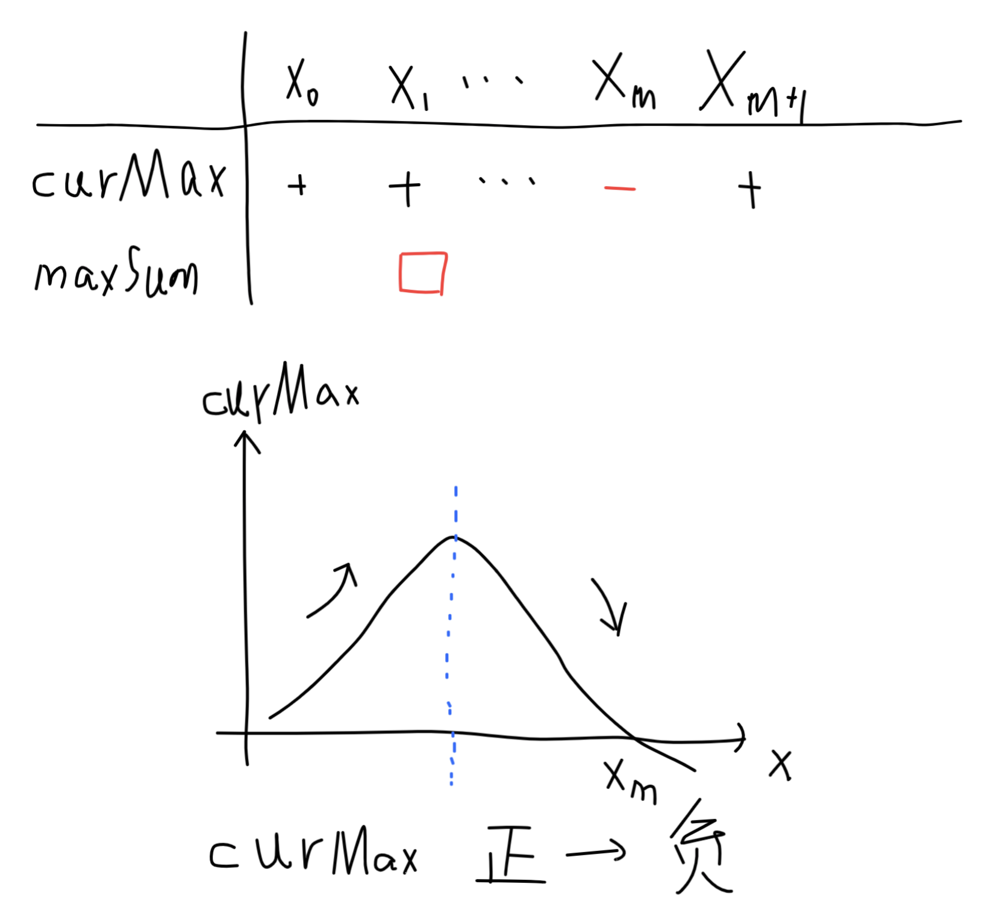

##    Maximum Subarray

Given an integer array `nums`, find the contiguous subarray (containing at least one number) which has the largest sum and return its sum.

**Example 1:**

```python
Input: [-2, 1, -3, 4, -1, 2, 1, -5, 4],
Output: 6
Explanation: [4, -1, 2, 1] has the largest sum = 6.
```

**Follow up:**

If you have figured out the O(*n*) solution, try coding another solution using the divide and conquer approach, which is more subtle.

### **分析：**

该题目使用**Kadane算法**可以很容易得到*O(n)*的时间复杂度。算法解析如下：

在数组遍历之前，设置两个变量`maxSum`初始化为负无穷，用来标记全局最大和；`curMax`初始化为0，用来记录当前循环的局部最大和。在遍历的过程中，如果`curMax > maxSum`则对全局的变量进行更新，否则不更新。那么遍历结束，得到的一定是全局的局部最大和。为什么是该值是全局最大，有如下分析：

假设当前数组循环为`i`，如果此时`curMax`是一个负数，那么进行`i+1`次循环的时候，就不需要将其相加，因为相加的结果一定使和`sum`变得更小，这不是我们求最大和想看到的。此时便可以将`curMax`置0，下一次循环开始重复这个过程（**我刚开始不接受这种设定，中间的数和后面的数加起来是否有可能更大？**）。我给不了数学上的证明，但是可以从下面图例，感性的分析一下，若有错误，请各位指正：



在整个循环过程中，`curMax`可能会经历多次上图的过程。当`curMax`为正数，可以继续与后面的数相加（$x_0$到$x_m$的过程）中间出现最大值保存到`maxSum`中（红色方框所示），当`curMax`变为负数后，舍弃前面所有的结果，重新计算（因为，`curMax`的变化如曲线图所示，蓝色虚线后面部分，使`curMax`有变小的趋势，这不是我们想要得到的，蓝色虚线后面的部分到$x_m$之间的数都不值得与$x_m$后面的数进行累加了）。

方法一和方法二均采用**Kadane算法**，其实现方式不一样。方法一更易于理解，方法二使用内建函数`max()`，简化了代码。当判断`curMax + a`和`a`的大小的时候，显然如果`curMax`是一个负数，那么返回一定是`a`.这里就等同于方法一的if判断。

Python3 代码如下：

```python
# 方法一
class Solution:
    def maxSubArray(self, nums: List[int]) -> int:
        curMax ,maxSum = 0, -float('inf')
        for a in nums:
            if curMax < 0: curMax = 0
            curMax += a
            maxSum = max(maxSum, curMax)
        
        return maxSum

# 方法二
class Solution:
    def maxSubArray(self, nums: List[int]) -> int:
        curMax, maxSum = 0, -float('inf')
        for a in nums:
            curMax = max(curMax + a, a)
            maxSum = max(maxSum, curMax)
        
        return maxSum
```

