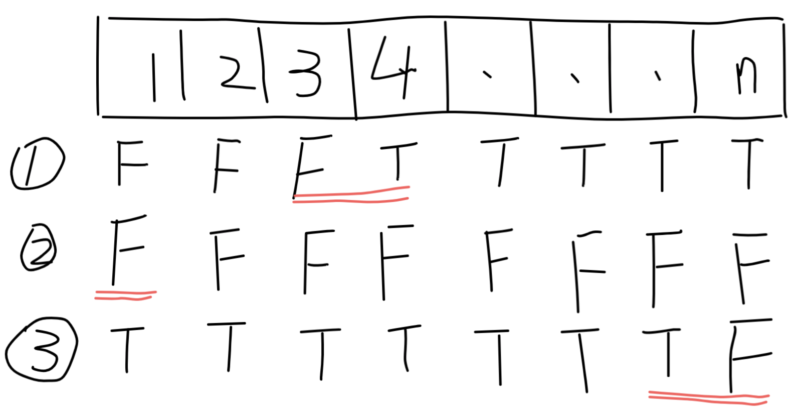

## First Bad Version

> You are a product manager and currently leading a team to develop a new product. Unfortunately, the latest version of your product fails the quality check. Since each version is developed based on the previous version, all the versions after a bad version are also bad.
>
> Suppose you have `n` versions `[1, 2, ... , n]` and you want to find out the first bad one, which causes all the following ones to be bad.
>
> You are given an API `bool isBadVersion(version)` which will return whether `version` is bad. Implement a function to find the first bad version. You should minimize the number of calls to the API.

**Example:**

Given `n = 5`, and `version = 4` is the first bad version.

`call isBadVersion(3) -> false`

`call isBadVersion(5) -> true`

`call isBadVersion(4) -> true`

Then 4 is the first bad version.

**分析：**

此问题可以看做一个快速查找的问题。如果使用遍历时间复杂度为O(n)显然是超时的。最直接想到的算法是**二分查找(Binary Search Algorithm)**，也叫**折半查找(Half-Interval Search Algorithm)**算法。该算法的时间复杂度为O(log n). 下面两段Python代码运行的时间和空间是相同的。其中上面的是我在结题是给出的解法。下面的是LeetCode给出的标准解法，当然给出的解法显然更加简洁，通用。

我的思路如下：该线性列表所存储的数据是顺序的，显然面对顺序表，首先想到的便是折半查找算法。其中边界是需要考虑的。如下图所示



该问题一共有三种特殊的状态，其中①代表最普通的情形，也就是第一个坏版本出现在整个版本序列的中间部位。②代表从第一个版本开始就是坏版本。③只有最后一个版本是坏版本。

对这三种情形进行三种判断。②和③好理解，①就需要用到二分查找进行分析了。设置while循环，循环条件为mid为T，mid前一个为F。不满足此条件的mid不是第一个坏版本。循环内部进行left和right区间的重新确定。最终程序退出，返回mid一定是第一个坏版本。

LeetCode网站上给出的解法为第二段Python代码。它没有将情形进行划分，而是直接返回了left上的值。分析可以发现。While循环条件设置为`left < right`，最终退出循环，一定是`left = right`即搜索空间被减少为一个元素，那么该元素一定是目标结果。

```python
# Runtime: 24ms
# Memory Usage: 13.9MB

# The isBadVersion API is already defined for you.
# @param version, an integer
# @return a bool
# def isBadVersion(version):

class Solution:
    def firstBadVersion(self, n):
        """
        :type n: int
        :rtype: int
        """
        if isBadVersion(1):
            return 1
        elif isBadVersion(n) and not isBadVersion(n-1):
            return n
        else:
            left = 1
            right = n
            mid = (left + right) // 2
            while (not (isBadVersion(mid) and (not isBadVersion(mid-1)))):
                if isBadVersion(mid):
                    right = mid
                    mid = (left + right) // 2
                    continue
                else:
                    left = mid
                    mid = (left + right) // 2
                    continue
            return mid

# Runtime: 24ms
# Memory Usage: 13.9MB
# Method from LeetCode Solution
class Solution:
    def firstBadVersion(self, n):
        """
        :type n: int
        :rtype: int
        """
        left = 1
        right = n
        while left < right:
          mid = left + (right - left) // 2
          if isBadVersion(mid):
            right = mid
          else:
            left = mid + 1
        return left
```
