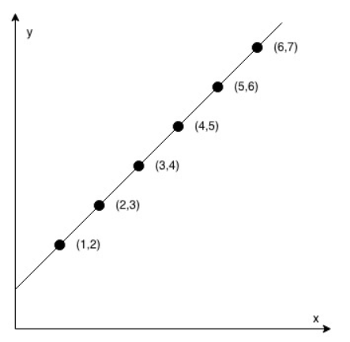
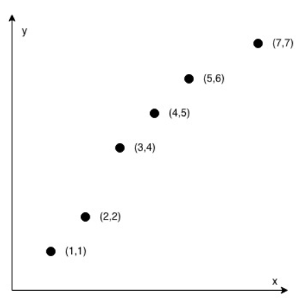

## Check If It is a Straight Line

You are given an array `coordinates, coordinates[i] = [x, y]`  where `[x, y]` represents the coordinate of a point. Check if these points make a straight line in the XY plane.

**Example 1:**



> **Input:** coordinates = [[1, 2], [2, 3], [3, 4], [4, 5], [5, 6], [6, 7]]
> **Output:** true

**Example 2:**



> **Input:** coordinates = [[1, 1], [2, 2], [3, 4], [4, 5], [5, 6], [7, 7]]
>
> **Output:** False

**Constraints:**

- `2 <= coordinates.length <= 1000`
- `coordinates[i].length == 2`
- `-10^4 <= coordinates[i][0], coordinates[i][1] <= 10^4`
- `coordinates` contains no duplicate point.

**Hints:**

1. If there're only 2 points, return true.
2. Check if all other points lie on the line defined by the first 2 points.
3. Use coress product to check collinearity.

**分析：**

该题目更多的是一个数学上的问题。根据提示可以知道**向量叉乘**可以判断二维向量是否在一条直线上。这里简单说明：$\vec a \times \vec b = \lvert \vec a \rvert \lvert \vec b \rvert \sin \theta$ 。如果差乘的结果为0，在向量 $\vec a$ 和向量 $\vec b$ 不是零向量的基础上，只有可能是他们间的夹角 $\theta$ 为0.那么即两向量共线。详细资料可以参考网络上的关于向量的**点乘（数量积、内积）、叉乘（向量积、外积）**区别含义。二维坐标形式为：$\vec a=(x_1, y_1), \vec b = (x_2, y_2)$ 有：$\vec a \times \vec b = x_1y_2 - x_2y_1$

如果不使用向量叉乘的方法，可以考虑使用**斜率**。使用斜率思想比较简单，首先确定前两个点的直线，判断后面的的点是不是在直线上。可以利用**直线方程**判断，也可以利用**点到直线的距离**判断。使用斜率需要考虑直线垂直于x轴的情况，即斜率不存在的情况，需要分开讨论。

**方法一：**

这里使用向量**叉乘**的方法解题。编写一个判断是否共线的函数`linecheck(p1, p2, p3)`，该函数参数为三个点的坐标。三个坐标可以得到两个向量，判断两个向量是否共线并返回`true`or`false`。`checkStraightLine`函数中判断列表长度，若长度为2，只有两个点，那么一定共线。否则遍历列表直到倒数第3个位置，依次判断三点是否共线。直到最后。中间出现不共线的情况直接返回`false`否则遍历完成，返回`true`.


Python3 代码如下：

```python
# 方法一
# Runtime: 64ms
# Memory Usage: 14.2MB
class Solution:
    def checkStraightLine(self, coordinates: List[List[int]]) -> bool:
        if len(coordinates) == 2:
            return True
        for i in range(len(coordinates)-2):
            if self.linecheck(coordinates[i], coordinates[i+1], coordinates[i+2]):
                continue
            else:
                return False
        return True
    
    
    def linecheck(self, p1, p2, p3):
        a = (p2[0] - p1[0]) * (p3[1] - p1[1])
        b = (p3[0] - p1[0]) * (p2[1] - p1[1])
        
        if a == b:
            return True
        else:
            return False

# 方法二
# Runtime: ms
# Memory Usage: MB

```

