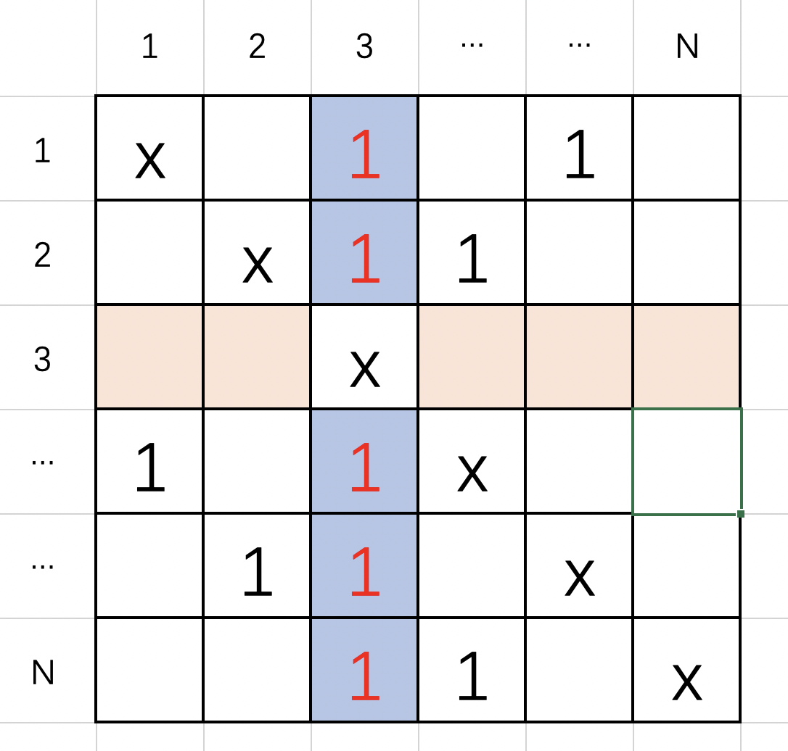

## Find the Town Judge

In a town, there are `N` people labbelled from `1` to `N`. There is a rumor that one of these people is secretly the town judge.

If the town judge exists, then:

1. The town judge trusts nobody.
2. Everybody (except for the town judge) trusts the town judge.
3. There is exactly one person that satisfies properties 1 and 2.

You are given `trust`, an array of pairs `trust[i] = [a, b]` representing that the person labelled `a` trusts the person labelled `b`.

If the town judge exists and can be identified, return the label of the town judge. Otherwise, return `-1`.

**Example 1:**

> **Input:** N = 2, trust = [1, 2]
>
> **Output:** 2

**Example 2:**

> **Input:** N = 3, trust = [[1, 3], [2, 3]]
>
> **Output:** 3

**Example 3:**

> **Input:** N = 3, trust = [[1, 3], [2, 3], [3, 1]]
>
> **Output:** -1

**Example 4:**

> **Input:** N = 3, trust = [[1, 2], [2, 3]]
>
> **Output:** -1

**Example 5:**

> **Input:** N = 4, trust = [[1, 3], [1, 4], [2, 3], [2, 4], [4, 3]]
>
> **Output:** 3

**Note:**

1. `1 <= N <= 1000`
2. `trust.length <= 10000`
3. `trust[i]` are all different
4. `trust[i][0] != trust[i][1]`
5. `1 <= trust[i][0], trust[i][1] <= N`

**分析：**

如下图所示：假设3是法官，那么除了3自己，所有的人都相信3（如红色的1所示），并且3不相信任何人（如浅橙色的空白所示）。



最简单的想法就是，遍历一次列表的同时构建两个字典，一个字典记录`trust[i][0]`被信任的次数。一个字典记录`trust[i][1]`是否相信别人。然后遍历整个人员N，若该索引人被信任了N-1次，并且没在另一个字典中出现，那么这个人就是法官。否则返回-1.


Python3 代码如下：

```python
# 方法一
# Runtime: 788ms
# Memory Usage: 18.4MB
class Solution:
    def findJudge(self, N: int, trust: List[List[int]]) -> int:
        if N == 1: return 1
        
        count = {}
        believe = {}
        for x in trust:
            if x[1] not in count:
                count[x[1]] = 1
            else:
                count[x[1]] += 1
            if x[0] not in believe:
                believe[x[0]] = 1
        for index in range(1, 1001):
            if index not in count: continue
            if (index not in believe) and (count[index] == N - 1): return index
        return -1
```

