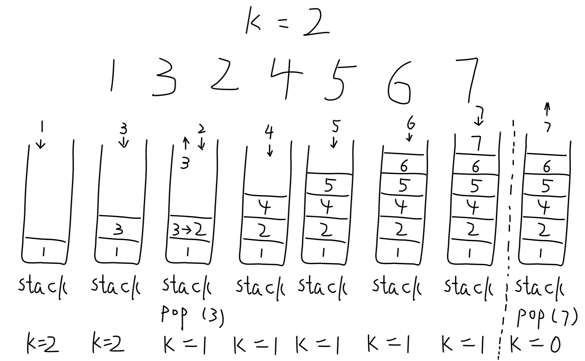

## Remove K Digits

Given a non-negative integer `num` represented as a string, remove `k` digits from the number so that the new number is the smallest possible.

**Note:**

- The length of num is less than 10002 and will be >= `k`.
- The give `num` does not contain any leading zero.

**Example 1:**

> Input: num = "1432219", k = 3
>
> Output: "1219"
>
> Explanation: Remove the three digits 4, 3 and 2 to form the new number 1219 which is the smallest.

**Example 2:**

> Input: num = "10200", k = 1
>
> Output: "200"
>
> Explanation: Remove the leading 1 and the number is 200. Note that the output must not contain leading zeros.

**Example 3:**

> Input: num = "10", k = 2
>
> Output: "0"
>
> Explanation: Remove all the digits from the number and it is left with nothing which is 0.

**分析：**

题意理解：给定一个字符串表示的非负整数`num`, 现要在字符串中删除`k`个数字，使得删除后数的值最小。**注意：题意中删除k个数字，并没有指定k个数字是连续的，给的Example 1并没有很好的说明这一点。**

如何保证一个多位整数比较小，显然高位数字越小，这个数越小。那么这个数如果从高位到低是升序，那么这个数一定比其他的排列方式要小，如`123456789`。那么本题的题意可以理解为，删除一个数中的几个数字，尽量保持删除后的数字是一个升序的状态（维护一个升序序列）。

考虑**情形一**：

如果整数`num`一共有k个字符，现在要删除k个字符。那么直接返回字符`0`即可。

考虑普遍**情形二**：

现在要选择删除哪个位置的数。要调整数的大小，显然从高位开始调整。末位对数大小的影不如高位。这里利用栈（后进先出）来存储删除后的数（**先入栈的数一定是高位，意味着它越小越好，如果后面的数比栈顶的数小，那么用该数替换栈顶的数，则最终可以最大程度的构建一个升序的状态**）。从高位开始遍历数`num`，依次让当前遍历值与栈顶元素进行比较，若当前值比站顶值小且删除数没达到k个，则意味着它可以替换当前栈顶的数。

当数遍历到末尾时，还没有删除满k个，那么意味着前面都是升的状态，直接从末尾删除满k个即可。如下图所示：



分析了一般的情况，就可以编写流程代码了。

Python3 代码如下：

```python
# 方法一
# Runtime: 40ms
# Memory Usage: 13.9MB
class Solution:
    def removeKdigits(self, num: str, k: int) -> str:
        if k == len(num): return '0'
        stack = []
        for n in num:
            while stack and k and int(stack[-1]) > int(n):
                stack.pop()
                k -= 1
            stack.append(n)
        while k:
            stack.pop()
            k -= 1
        if not stack:
            return '0'
        return str(int("".join(stack)))
```

