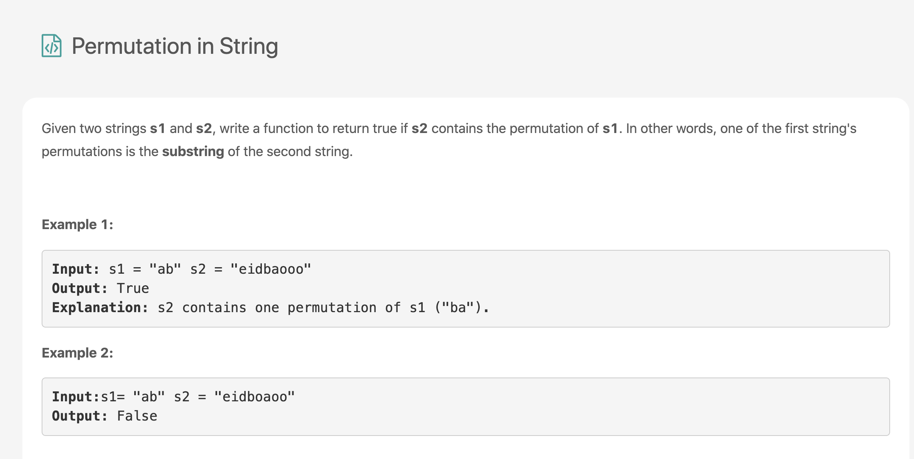

[题目连接](https://leetcode.com/problems/permutation-in-string/)

### **分析：**

此题跟之前的一题是一样的，均是采用滑动窗口思想和哈希表的应用。这里不做过多描述，可以参考之前的博文LeetCode 17 May。

```python
# 方法一
# Runtime: 108ms
# Memory Usage: 15MB
class Solution:
    def checkInclusion(self, s1: str, s2: str) -> bool:
        if len(s1) == 0 or len(s2) == 0: return False
        dic_s1 = [0] * 26
        dic_s2 = [0] * 26
        for char_s1 in s1:
            dic_s1[ord(char_s1)-97] += 1
        left = right = 0
        while right < len(s2):
            dic_s2[ord(s2[right])-97] += 1
            if right - left + 1 < len(s1):
                right += 1
            else:
                if dic_s1 == dic_s2:
                    return True
                else:
                    dic_s2[ord(s2[left])-97] -= 1
                    left += 1
                    right += 1
        return False
```

