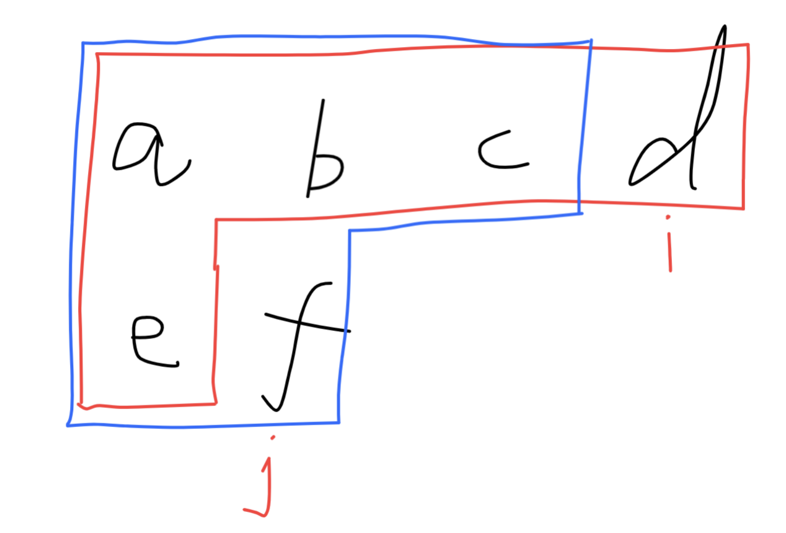

## Uncrossed Lines

We write the integers of `A` and `B` (in the order they are given) on two separate horizontal lines.

Now, we may draw *connecting lines*: a straight line connecting two numbers `A[i]` and `B[j]` such that:

- `A[i] == B[j]`;
- The line we draw does not intersect any other connecting (non-horizontal) line.

Note that a connecting lines cannot intersect even at the endpoints: each number can only belong to one connecting line.

Return the maximum number of connecting lines we can draw in this way.

**Example 1:**


```python
Input: A = [1,4,2], B = [1,2,4]
Output: 2
Explanation: We can draw 2 uncrossed lines as in the diagram.
We cannot draw 3 uncrossed lines, because the line from A[1]=4 to B[2]=4 will intersect the line from A[2]=2 to B[1]=2.
```

**Example 2:**

```
Input: A = [2,5,1,2,5], B = [10,5,2,1,5,2]
Output: 3
```

**Example 3:**

```
Input: A = [1,3,7,1,7,5], B = [1,9,2,5,1]
Output: 2
```

 

**Note:**

1. `1 <= A.length <= 500`
2. `1 <= B.length <= 500`
3. `1 <= A[i], B[i] <= 2000`

### **分析：**

本题采用动态规划的方法进行分析。其子问题就是当字符串添加一个元素的时候，考虑其之前的状态。取之前状态的最值，并比较当前添加元素的状态是否符合+1操作。如下图所示：



当循环到两个字符串的`i`和`j`节点位置的时候，需要判断`[i][j-1]`（红色方框）和`[i-1][j]`（蓝色方框）状态时候的最大数量，取其最大值。最后判断最后面的两个字符是否相等，相等则对`[i-1][j-1]`状态进行+1操作（这里需要注意，因为题目说的是不能出现交叉现象，因此对`[i-1][j-1]`位置进行+1，下面的递归方法就是在这个位置没做好，导致数量偏多）。

这里使用递归的方法应该也是可以解题的，只是如果不优化，速度会很慢。（递归方法运行Wrong Answer，我想问题是出在了第二个if里面。由于递归到最后，只剩下最后一个元素了，因此不能比较前一个的状态。或许递归应该采用其他的方法如：引入索引值，而不是用空列表作为return条件）

```python
# 动态规划
class Solution:
    def maxUncrossedLines(self, A: List[int], B: List[int]) -> int:
        m = len(A)
        n = len(B)
        dp = [[0 for i in range(n + 1)] for j in range(m + 1)]
        
        for i in range(1, m + 1):
            for j in range(1, n + 1):
                dp[i][j] = max(dp[i][j-1], dp[i-1][j])
                if A[i-1] == B[j-1]:
                    dp[i][j] = max(dp[i-1][j-1] + 1, dp[i][j])
        return dp[m][n]
      
# 递归（此方法有问题，需要更改）
class Solution:
    def maxUncrossedLines(self, A: List[int], B: List[int]) -> int:
        if not A or not B: return 0
        res = max(self.maxUncrossedLines(A[1:], B), self.maxUncrossedLines(A, B[1:]))
        if A[0] == B[0]:    # 这个if里面少了一个前一个状态的判断
            res += 1
        return res
```

