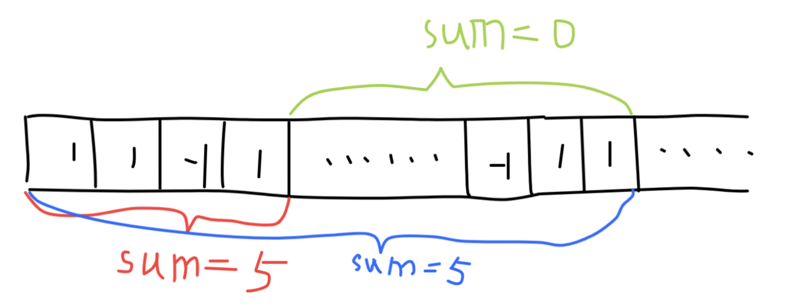

## Contiguous Array

Given a binary array, find the maximum length of a contiguous subarray with equal number of 0 and 1.

**Example 1:**

```
Input: [0,1]
Output: 2
Explanation: [0, 1] is the longest contiguous subarray with equal number of 0 and 1.
```


**Example 2:**

```
Input: [0,1,0]
Output: 2
Explanation: [0, 1] (or [1, 0]) is a longest contiguous subarray with equal number of 0 and 1.
```


**Note:** The length of the given binary array will not exceed 50,000.

### **分析：**

暴力解法是使用两层循环，查找每一种长度区间的可能。时间复杂度$O(n)$空间复杂度$O(1)$。测试集长度不会超过50,000，这种方法一定会超时。

这里使用类似于字符串的模式匹配算法的思想（KMP算法记录了其前缀的位置，这里记录了前面求和的信息），方法如下：

将数组中0元素转换成-1，然后遍历数组求和sum。并将sum对应的索引index记录到字典中。因为1和-1是一个相反的计算，且和sum是不停向上累加的，如果当前sum已经出现在字典中，意味着字典中的sum索引到当前位置一定是一块连续的0，1成对出现的子区间，区间大小为当前索引index减去字典中的索引。**特殊情况就是如果sum等于0，那么整个列表开头到当前位置都是成对的0和1.**

简单示例如下图所示：



sum从头开始累加，红色区间和为5，蓝色区间和也是5，那么一定有绿色区间和为0，意味着，绿色区间-1和1一定是成对出现的。那么-1是由0转换而来。因此记录了整个列表的其中一种情况，当下次计算结果与当前结果比较，最终一定可以取得一个最大值。

```python
# 这里使用字典变量存储位置信息
# 如果需要提升运行速度，可以将字典换成列表方式
class Solution:
    def findMaxLength(self, nums: List[int]) -> int:
        if len(nums) == 0: return 0
        sum, indexDic, ans= 0, {}, 0
        
        for index in range(len(nums)):
            sum += nums[index] if nums[index] == 1 else -1
            if sum == 0:
                ans = index + 1
            elif sum in indexDic:
                ans = max(ans, index - indexDic[sum])
            else:
                indexDic[sum] = index
        return ans
```

