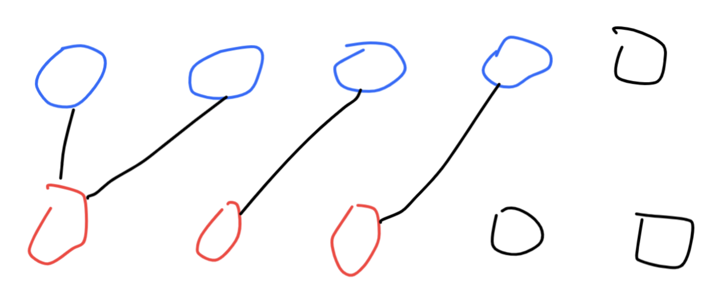

## Possible Bipartition

Given a set of `N` people (numbered `1, 2, ..., N`), we would like to split everyone into two groups of **any** size.

Each person may dislike some other people, and they should not go into the same group. 

Formally, if `dislikes[i] = [a, b]`, it means it is not allowed to put the people numbered `a` and `b` into the same group.

Return `true` if and only if it is possible to split everyone into two groups in this way.

**Example 1:**

```
Input: N = 4, dislikes = [[1,2],[1,3],[2,4]]
Output: true
Explanation: group1 [1,4], group2 [2,3]
```

**Example 2:**

```
Input: N = 3, dislikes = [[1,2],[1,3],[2,3]]
Output: false
```

**Example 3:**

```
Input: N = 5, dislikes = [[1,2],[2,3],[3,4],[4,5],[1,5]]
Output: false
```

 

**Note:**

1. `1 <= N <= 2000`
2. `0 <= dislikes.length <= 10000`
3. `1 <= dislikes[i][j] <= N`
4. `dislikes[i][0] < dislikes[i][1]`
5. There does not exist `i != j` for which `dislikes[i] == dislikes[j]`.

### **分析：**

本题是一个**图的分类问题**，也可以理解为**图节点着色问题**。需要将`1 to N`的图节点分成两组，组内节点之间没有连线（path）。两组之间节点可以有连线。如下图所示（视频讲解可以看[花花酱 LeetCode 886](https://www.youtube.com/watch?v=VlZiMD7Iby4)）



节点总的来说可以分为三类，这里用**红色**、**蓝色**、**黑色**表示。其中红色和蓝色相互讨厌，不能分在一组。黑色无关紧要，可以分配在任何一组。这里使用图的遍历算法如DFS或BFS均可以。由于图不是联通的，所以需要对每个节点进行DFS，以判断其联通节点的颜色。

首先建立两个数组结构`colors_`和`graph`分别用来存储**每个节点的颜色信息**和**图的路径信息**。`colors_`数组初始状态为0，为未着色状态。状态1表示红色，-1表示蓝色。图的节点数量N最大不超过2000，根据题意0 <= dislikes.length <= 10000，如果图path信息用N*N的矩阵表示过于浪费空间，可以将数组的第一个维度设置为N，第二个维度只存储存在连接的节点信息。

接下来一个for循环对colors_中的每一个节点进行染色操作。

1. 如果当前节点值为0（没有被染色）且dfs返回值为False（染色冲突：①当前节点被染A色，而与其连接的path节点，也已经被染A色，意味着被分为一组了，不符题意。②当前节点被染A色，与其连接的path节点没有被染色，但是递归调用dfs染-A色的时候，发生False）则返回False，该图不能二分
2. 如果所有节点都被成功染色，那么返回True。改图可以被二分


```python
class Solution:
    def possibleBipartition(self, N: int, dislikes: List[List[int]]) -> bool:
        # colors_: List, N values. record the color of each node
        # graph: List, [[],[]], record the path of any two nodes
        colors_ = [0 for _ in range(N)]
        graph = [[] for _ in range(N)]
        for path in dislikes:
            graph[path[0] - 1].append(path[1] - 1)
            graph[path[1] - 1].append(path[0] - 1)
         
        # all nodes can be dyed, return True
        for i in range(N):
            if colors_[i] == 0 and not self.dfs(i, 1, colors_, graph):
                return False
        return True

    # paint the current node and it's connected nodes.
    def dfs(self, current, color, colorList, G):
        colorList[current] = color
        for nxt in G[current]:
            if colorList[nxt] == color: return False
            if colorList[nxt] == 0 and not self.dfs(nxt, -color, colorList, G): return False
        return True
```

