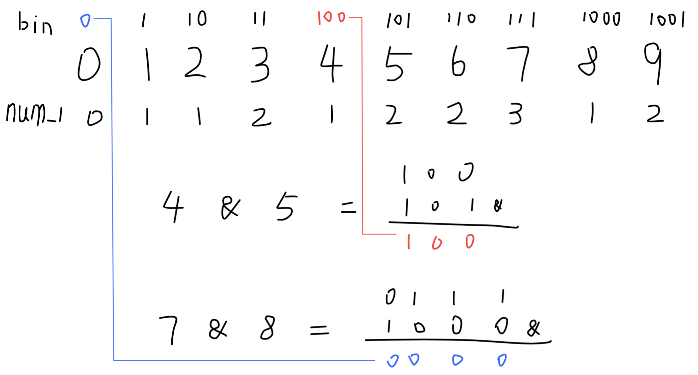

## Possible Bipartition

Given a non negative integer number **num**. For every numbers **i** in the range **0 ≤ i ≤ num** calculate the number of 1's in their binary representation and return them as an array.

**Example 1:**

```
Input: 2
Output: [0,1,1]
```

**Example 2:**

```
Input: 5
Output: [0,1,1,2,1,2]
```

**Follow up:**

- It is very easy to come up with a solution with run time **O(n\*sizeof(integer))**. But can you do it in linear time **O(n)** /possibly in a single pass?
- Space complexity should be **O(n)**.
- Can you do it like a boss? Do it without using any builtin function like **__builtin_popcount** in c++ or in any other language.

### **分析：**

本题实现上没有什么难度，只要知道一个逻辑与运算`&`的小技巧便可以很快的得到答案。写一个案例分析如下图：



中间为数n，上面以上是其二进制形式，下面为其二进制形式包含1的个数。举两个例子，求5和8两个数的二进制形式1的个数，可以通过逻辑与`&`运算，计算`4 & 5`和`7 & 8`的结果，第一个结果为`100`,在上面表中对应的是4的位置，4的个数为1，那么5的结果为1+1=2。同理，8的结果为数字0的个数+1操作，0+1=1.

我不知道怎么去证明这样的关系，可能是二进制进位之间的规律。那么这里只要记录一个已经求出来状态的数组表res，如果所求数字已经在表中，那么可以直接返回，如果不在表中，那么可以直接按照这一规律接着扩展该表即可。

```python
# Runtime: 76 ms
# Memory Usage: 20.6 MB
class Solution:
    def countBits(self, num: int) -> List[int]:
        res = [0]
        preLen = len(res) - 1
        
        if num == 0: return res
        if num <= preLen:
            return res[:num]
        else:
            for x in range(preLen+1, num+1):
                res.append(res[x & (x - 1)] + 1)
            return res
```

