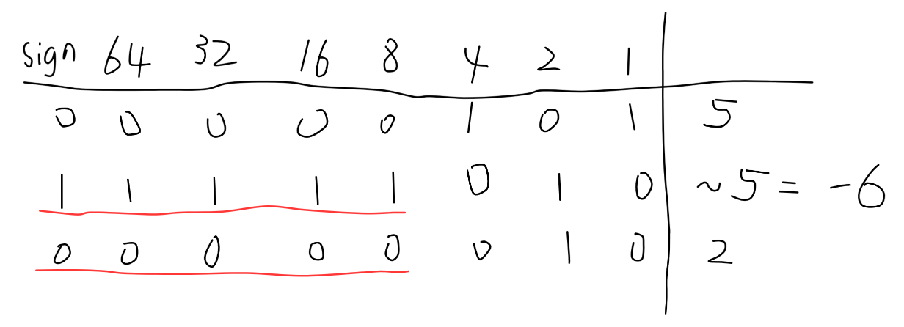

## Number Complement

Given a positive integer, output its complement number. The complement strategy is to flip the bits of its binary representation.

**Example 1:**

> **Input: ** 5
>
> **Output: ** 2
>
> **Explanation: ** The binary representation of 5 is 101 (noleading zeros bits), and its complement is 010. So you need to output 2.

**Example 2:**

> **Input: ** 1
>
> **Output: ** 0
>
> **Explaination: ** The binary representation of 1 is 1 (no leading zero bits), and its complement is 0. So you need to output 0.

**Note: **

1. The given integer is guaranteed to fit within the range of a 32-bit signed integer.
2. You could assume no leading zero bit in the integer's binary representation.
3. This question is the same as 1009: [https://leetcode.com/problems/complement-of-base-10-integer/](https://leetcode.com/problems/complement-of-base-10-integer/)

**分析：**

本题首先想到的就是使用取反的位运算来进行解答。但是使用位运算的时候就不得不考虑高bit位也同样被取反的问题。如下图中的红色部分。



不同的编程语言其数据表达方式不同，即不同的系统int型数据占用的字节数不同。这就需要根据语言设计不同的算法来控制高bit位的取反。数在计算机中的表达方式有助于理解题意，即[原码、反码、补码](https://leetcode.com/problems/complement-of-base-10-integer/)的知识，当然本题目并不涉及这些知识。我们只需要知道①如果直接使用取反操作，那么高位的bit位也被取反操作了，我们需要将高位bit位再次取反，以恢复其本来状态。②可以直接使用之前讨论过的**半加运算符**即**异或运算**（[参考另一篇](https://blog.csdn.net/weixin_46391502/article/details/105852745)）对正数的不包含前导位0的部分进行直接取反操作如下图所示。


只需要构造低bit位的全1值，与所求值进行异或运算，就可以对蓝色部分进行取反操作而不影响其他部位的数字。

这里通过math包的log方法求得该数的二进制形式有多少位，然后通过对1的移位(a)和减去1(b)的操作得到全1的mask值。对mask和所求值进行异或操作，可以得到目标结果。过程如下图所示


Python3 代码如下：

```python
# Runtime: 20ms
# Memory Usage: 13.8MB
class Solution:
    def findComplement(self, num: int) -> int:
        mask = (1 << 1 + int(math.log(num, 2))) - 1
        return mask ^ num
```

