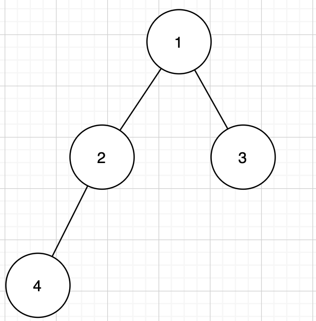
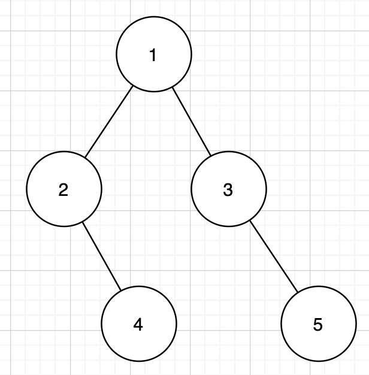
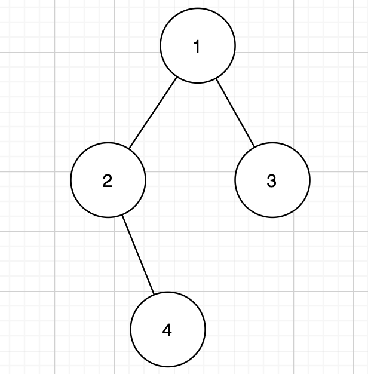

## Cousins in Binary Tree

In a binary tree, the root node is at depth `0`, and children of each depth `k` node are at depth `k+1`. 

Two nodes of a binary tree are **cousins** if they have the same depth, but have **different parents**. 

We are given the `root` of a binary tree with unique values, and the values `x` and `y` of two different nodes in the tree.

Return `true` if and only if the nodes corresponding to the values `x` and `y` are cousins.

**Example 1:**



> **Input:** root = [1, 2, 3, 4], x = 4, y = 3
> **Output:** False

**Example 2:**



> **Input:** root = [1, 2, 3, null, 4, null, 5], x = 5, y = 4
>
> **Output:** True

**Example 3:**



> **Input:** root = [1, 2, 3, null, 4], x = 2, y = 3
>
> **Output:** False

**Note:**

1. The number of nodes in the tree will be between `2` and `100`.
2. Each node has a unique integer value from `1` to `100`.

**分析：**

题目含义：给定一棵二叉树，二叉树的节点范围为`2`到`100`，其中不包含重复的节点值。若给出两个节点值`x`和`y`，判断`x`和`y`是否是堂兄弟节点（节点深度相同但父节点不同）。若是返回`True`否则返回`False`。

问题的本质是对二叉树进行搜索，并记录当前节点的值、父节点和深度。

涉及到二叉树的遍历，那么遍历方法多种多样：前序、中序、后续（这三种方法其遍历路径是相同的，本质为**深度优先搜索（DFS）**），层序（可以理解为**广度优先搜索（BFS）**）。

不同的搜索方法有其自身的特性。这里不深入讨论。

**方法一：**

利用DFS方法遍历整棵树，由于每个节点的值都是唯一的，那么在遍历的同时可以创建一个字典，key为节点值，value存储该节点的parent、depth信息。当结束循环，在字典中查询`x`和`y`的信息，判断后可以返回`True`or`False`.


Python3 代码如下：

```python
# 方法一
# Runtime: 24ms
# Memory Usage: 13.8MB
class Solution:
    def isCousins(self, root: TreeNode, x: int, y: int) -> bool:
        self.nodeDic = {}
        self.dfs(root, None, 1)
        if self.nodeDic[x][1] == self.nodeDic[y][1] and self.nodeDic[x][0] != self.nodeDic[y][0]:
            return True
        else:
            return False
        
    def dfs(self, root, parent, depth):
        if not root:
            return 
        self.nodeDic[root.val] = (parent, depth)
        self.dfs(root.left, root, depth + 1)
        self.dfs(root.right, root, depth + 1)

# 方法二
# Runtime: ms
# Memory Usage: MB

```

