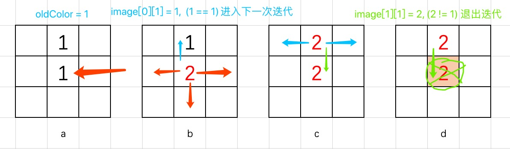
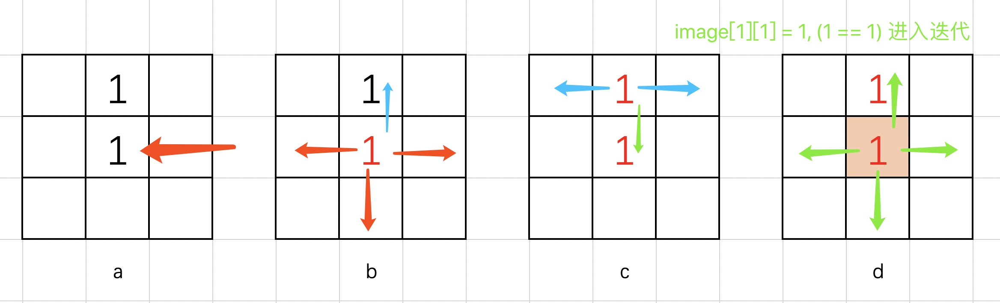

## Flood Fill

An `image` is represented by a 2-D array of integers, each integer representing the pixel value of the image (from 0 to 65535).

Given a coordinate `(sr, sc)` representing the starting pixel (row and column) of the flood fill, and a pixel value `newColor`, "flood fill" the image.

To perform a "flood fill", consider the starting pixel, plus any pixels connected 4-directionally to the starting pixel of the same color as the starting pixel, plus any pixels connected 4-directionally to those pixels (also with the same color as the starting pixel), and so on. Replace the color of all of the aforementioned pixels with the newColor.

At the end, return the modified image.

**Example 1:**

**Input:**

```pytho
image = [[1, 1, 1], 
         [1, 1, 2], 
         [1, 0, 1]]
         
sr = 1, sc = 1, newColor = 2
```

**Output:**

```python
[[2, 2, 2],
 [2, 2, 0],
 [2, 0, 1]]
```

**Explanation:**

From the center of the image (with position (sr, sc) = (1, 1)), all pixels connected by a path of the same color as the starting pixel are colored with the new color. Note the bottom corner is not colored 2, because it is not 4-directionally connected to the starting pixel.

**Note:**

- The length of `image` and `image[0]` will be in the range `[1, 50]`.
- The given starting pixel will satisfy `0 <= sr < image.length` and `0 <= sc < image[0].length`.
- The value of each color in `image[i][j]` and `newColor` will be an integer in `[0, 65535]`.

**分析：**

本题目是**Flood Fill** 算法的应用。该算法的详细信息可以参考[labuladong的算法小抄](https://labuladong.gitbook.io/algo/suan-fa-si-wei-xi-lie/floodfill-suan-fa-xiang-jie-ji-ying-yong). 

给定一个二维矩阵表示的图片，图片中的每一个像素都有三个信息`[sr, sc, oldColor]`，任意选取图像中的一个像素进行涂色，颜色为`newColor`，涂完的该像素后将与之相邻的上、下、左、右四个像素点进行判断，如果相邻的四个像素与第一个着色的像素相同（`oldColor`），那么该颜色也将被涂上`newColor`. 如果超过图片边界或者与第一个着色的颜色不同，则跳过此像素。最终返回着色后的图像。

很显然，递归可以很好解决这个问题。可以理解为一个四叉树的递归。

首先定义递归函数`fill(sr, sc, newColor, oldColor, image)`, 一共有5个参数。递归的出口如上所述，①当超过边界，②或待涂色的像素点原始颜色与第一个像素的颜色(`oldColor`)不同时，函数退出。

递归函数在设计时，有一个细节需要注意。何时对像素快进行涂色操作（`image[sr][sc] = newColor`）.分析过二叉树的递归可以知道，不论是前序、中序或后序递归，递归函数在二叉树结构上游走的顺序都是一样的。也就是说，我们何时进行着色操作都可以，但是如果在递归前就进行着色操作会造成一个递归死循环的问题，程序无法退出。

考虑这种情形，如果第一个待涂的像素`oldColor`和`newColor`相同。可以推理出这个图就不需要进行涂色了，程序可以直接退出（**这里是本问题最好的解决方法**）。但还有一种方法可以避免在程序一开始就进行`oldColor`和`newColor`的判断。

如下图所示：

涂的第一个像素点为`(1, 1)`,新像素值`newColor`为2，待涂装的像素值为1（如图a到b所示），意味着以后只会涂相邻的且为1的像素（上下左右四个方向）。我们只关注蓝色那个进程（如图b所示），蓝色箭头符合涂装的条件，涂为2后进行下一次递归（如图c所示，这里关注绿色箭头）。因为经过第一次涂色，此时的像素值经过首次递归的调整已变为2，`image[1][1] != oldColor, (2 != 1)`, 不符合递归条件。程序退出。



但是当新像素值不是2，与涂的第一个像素点值相同时，会造成递归死循环。如下图，假设`newColor = 1`,这里关注图d的状态。绿色箭头并没有退出递归，因此造成了无线递归循环。



这里可以更改递归函数`fill()`中的颜色修改顺序。上述问题的出现是因为递归的出口只判断了当前像素点的值，并没有判断过是否修改。若在进入递归之前将改点处的值改为`-1`（可以是`0-65535`之外的任意值），在出递归的时候将该点的值改为`newColor`。这样就不用考虑颜色判断的问题。递归也不会陷入死循环了。**该方法是一种回溯思想。**详细资料可以参考 [回溯思想](https://labuladong.gitbook.io/algo/suan-fa-si-wei-xi-lie/hui-su-suan-fa-xiang-jie-xiu-ding-ban)。
本题python示例代码如下：

```python
    def fill(self, sr, sc, newColor, oldColor, image):
        if sr < 0 or sr >= len(image) or sc < 0 or sc >= len(image[0]): return
        if image[sr][sc] != oldColor:
            return
        else: 
            image[sr][sc] = -1
            self.fill(sr, sc+1, newColor, oldColor, image)
            self.fill(sr, sc-1, newColor, oldColor, image)
            self.fill(sr-1, sc, newColor, oldColor, image)
            self.fill(sr+1, sc, newColor, oldColor, image)
            image[sr][sc] = newColor
```

Python3 代码如下：

```python
# 方法一
# Runtime: 68ms
# Memory Usage: 13.9MB
class Solution:
    def floodFill(self, image: List[List[int]], sr: int, sc: int, newColor: int) -> List[List[int]]:
        oldColor = image[sr][sc]
        if oldColor == newColor: return image
        self.fill(sr, sc, newColor, oldColor, image)
        return image
        
    def fill(self, sr, sc, newColor, oldColor, image):
        if sr < 0 or sr >= len(image) or sc < 0 or sc >= len(image[0]): return
        if image[sr][sc] != oldColor:
            return
        else: 
            image[sr][sc] = newColor
            self.fill(sr, sc+1, newColor, oldColor, image)
            self.fill(sr, sc-1, newColor, oldColor, image)
            self.fill(sr-1, sc, newColor, oldColor, image)
            self.fill(sr+1, sc, newColor, oldColor, image)
```

