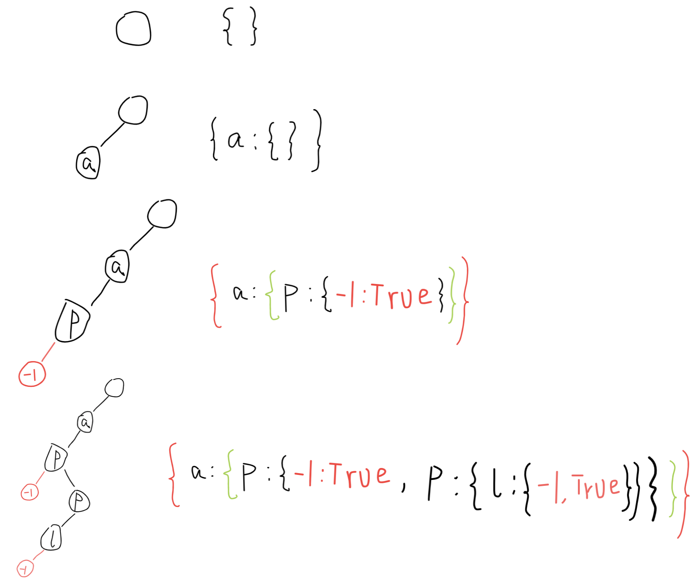

## Implement Trie (Prefix Tree)

Implement a trie with `insert`,`search`,and `startsWith` methods.

**Note:**

- You may assume that all inputs are consist of lowercase letters `a to z`.
- All inputs are guaranteed to be non-empty strings.

**Example 1:**

> ```python
> Trie trie = new Trie()
> 
> trie.insert("apple")
> trie.search("apple")    # return true
> trie.search("app")    # return false
> trie.startsWith("app")    # return true
> trie.insert("app")
> trie.search("app")    # return true
> ```
>
> 

### **分析：**

该问题是一个**前缀树**、**字典树**问题。其概念可以参考[维基百科-字典树](https://zh.wikipedia.org/wiki/Trie)。

题目一共分为四个部分

- 构建一个字典树
- 插入一个字符串
- 查找字典树中是否存在该字符串
- 判断一个字符串是否是该字典树的前缀。

**构建一个字典树**： 需要考虑采用的数据结构，不同的编程语言可以采用不同的存储结构，这里使用python编程环境。通过字典的嵌套可以构建这么一个字典树，解释如下图所示



根节点不存储信息，可以用一个空字典表示。每一个节点只存储一个字符。假设要存储字符串`“ap”`。当存储字符a的时候，判断当前字典树为空不包含a字符，在空字典中创建一个新的`key-val`键值对，`key = a, val = {}`。接着插入字符p时，则紧接着在a的键值对空字典中插入p字符，同时创建p的val也是一个空字典。字符串字符全部存储完毕，需要设置一个标记，标记该字符串被完整存储。这里使用`key-val => -1:True`作为标记，存储在p的键值对空字典中。那么表示`ap`字符串已经存储在字典树中。p节点此时依然可以作为其他字符串的前缀。如`appl`也存储在字典树中。那么键值对`-1:True`是字符串结束的标志，没有该标志的节点就只能是前缀。

根据上述思路，可以构建python代码如下（代码参考了网上的博主，如有冒犯请联系删除。）：

Python3 代码如下：

```python
# 方法一
# Runtime: 124ms
# Memory Usage: 26.9MB
class Trie:

    def __init__(self):
        """
        Initialize your data structure here.
        """
        self.root = {}
        self.word_end = -1

    def insert(self, word: str) -> None:
        """
        Inserts a word into the trie.
        """
        curNode = self.root
        for c in word:
            if c not in curNode:
                curNode[c] = {}
            curNode = curNode[c]
            
        curNode[self.word_end] = True

    def search(self, word: str) -> bool:
        """
        Returns if the word is in the trie.
        """
        curNode = self.root
        for c in word:
            if c not in curNode:
                return False
            curNode = curNode[c]
        
        # Check if curNode has end flag now.
        if self.word_end not in curNode:
            return False
        
        return True
        

    def startsWith(self, prefix: str) -> bool:
        """
        Returns if there is any word in the trie that starts with the given prefix.
        """
        curNode = self.root
        for c in prefix:
            if c not in curNode:
                return False
            curNode = curNode[c]
        
        return True
        


# Your Trie object will be instantiated and called as such:
# obj = Trie()
# obj.insert(word)
# param_2 = obj.search(word)
# param_3 = obj.startsWith(prefix)
```

