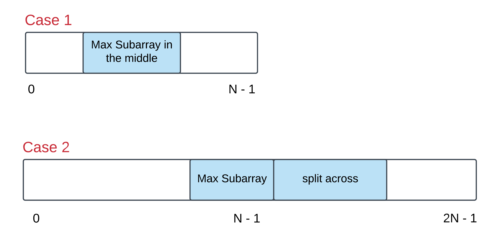

##    Maximum Sum Circular Subarray

Given a **circular array C** of integers represented by `A`, find the maximum possible sum of a non-empty subarray of `C`.

Here, a circular array means the end of the array connects to the beginning of the array. (Formally, `C[i] = A[i]` when `0 <= i < A.length`, and `c[i+A.length] = C[i]` when `i >= 0`)

Also, a subarray may only include each element of the fixed buffer `A` at most once. (Formally, for a subarray `C[i], C[i+1], ..., C[j]`, there does not exist `i <= k1, k2 <=j` with `k1 % A.length = k2 % A.length`.)

**Note:**

- `-30000 <= A[i] <= 30000`
- `1 <= A.length <= 30000`

**Example 1:**

```python
Input: [1, -2, 3, -2]
Output: 3
Explanation: Subarray [3] has maximum sum 3
```

**Example 2:**

```python
Input: [5, -3, 5]
Output: 10
Explanation: Subarray [5, 5] has maximum sum 5 + 5 = 10
```

**Example 3:**

```python
Input: [3,-1,2,-1]
Output: 4
Explanation: Subarray [2,-1,3] has maximum sum 2 + (-1) + 3 = 4
```

**Example 4:**

```python
Input: [3,-2,2,-3]
Output: 3
Explanation: Subarray [3] and [3,-2,2] both have maximum sum 3
```

**Example 5:**

```python
Input: [-2,-3,-1]
Output: -1
Explanation: Subarray [-1] has maximum sum -1
```

**Hint #1:**

For those of you who are familiar with the **Kadane's algorithm**, think in terms of that. For the newbies, Kadane's algorithm is used to finding the maximum sum subarray from a given array. This problem is a twist on that idea and it is advisable to read up on that algorithm first before starting this problem. Unless you already have a great algorithm brewing up in your mind in which case, go right ahead!

**Hint #2:**

What is an alternate way of representing a circular array so that it appears to be a straight array? Essentially, there are two cases of this problem that we need to take care of. Let's look at the figure below to understand those two cases:



**Hint #3:**

The first case can be handled by the good old Kadane's algorithm. However, is there a smarter way of going about handling the second case as well?

### **分析：**

此题跟**LeetCode 53 Maximum Subarray**具有很高的相似性（使用**Kadane算法**）。主要思想是利用动态规划，寻找局部最优和全局最优解。

根据提示，如何解决这环形数组的问题，参考了[LeetCode讨论社区](https://leetcode.com/problems/maximum-sum-circular-subarray/discuss/178422/One-Pass)的图片，解释如下图所示：


已知一个数组的和(sum)是固定的，要使得蓝色Max和Subarray部分最大，那么红色Min subarray一定最小。利用**Kadane算法**变可以求出。**(关于Kadane算法的解释，可以看我的另一篇博文)**

看了大神的代码，再看自己的，实在是不想放上来了。。。还需努力啊~

Python3 代码如下：（参考了[LeetCode讨论社区](https://leetcode.com/problems/maximum-sum-circular-subarray/discuss/178422/One-Pass)）

```python
# 方法一
# Runtime: 556ms
# Memory Usage: 18MB
class Solution:
    def maxSubarraySumCircular(self, A: List[int]) -> int:
        total, maxSum, curMax, minSum, curMin = 0, -float('inf'), 0, float('inf'), 0
        for a in A:
            curMax = max(curMax + a, a)
            maxSum = max(maxSum, curMax)
            curMin = min(curMin + a, a)
            minSum = min(minSum, curMin)
            total += a
        return max(maxSum, total - minSum) if maxSum > 0 else maxSum
```

